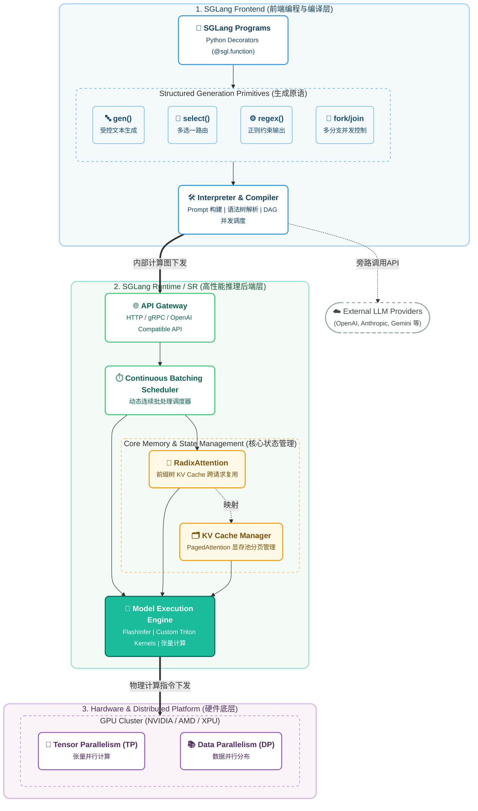
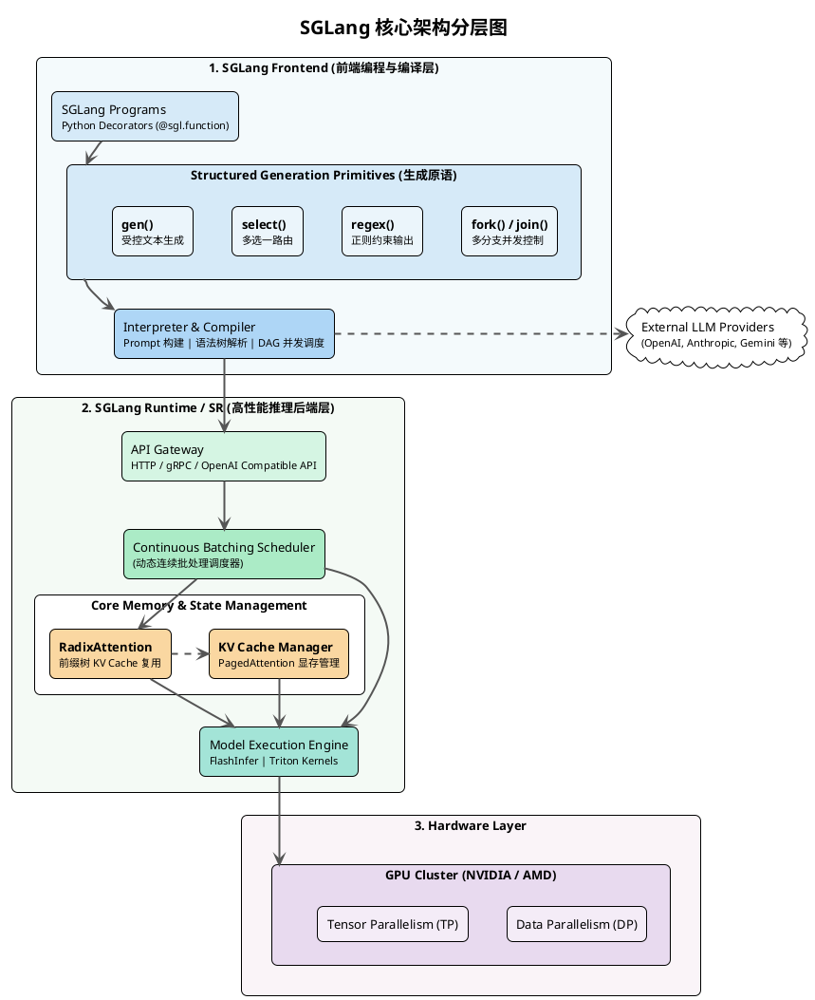

```mermaid
flowchart TB
    %% ================= 样式定义 (纯净兼容扁平化设计) =================
    classDef frontendNode fill:#FFFFFF,stroke:#3498DB,stroke-width:2px,color:#154360,rx:8,ry:8
    classDef primitiveNode fill:#F4FAFC,stroke:#85C1E9,stroke-width:1.5px,color:#1B4F72,rx:6,ry:6
    classDef backendNode fill:#FFFFFF,stroke:#2ECC71,stroke-width:2px,color:#0E6251,rx:8,ry:8
    
    %% 核心引擎使用重色块反白突出
    classDef engineNode fill:#1ABC9C,stroke:#0E6655,stroke-width:2px,color:#FFFFFF,rx:8,ry:8
    
    classDef memoryNode fill:#FEF9E7,stroke:#F39C12,stroke-width:2px,color:#7E5109,rx:8,ry:8
    classDef hardwareNode fill:#FFFFFF,stroke:#9B59B6,stroke-width:2px,color:#512E5F,rx:8,ry:8
    classDef externalNode fill:#FDFEFE,stroke:#95A5A6,stroke-width:2px,stroke-dasharray: 6 6,color:#424949,rx:20,ry:20

    %% ================= 外部接口 =================
    ExternalAPI(["☁️ External LLM Providers<br/><small>(OpenAI, Anthropic, Gemini 等)</small>"]):::externalNode

    %% ================= 1. 前端层 =================
    subgraph FrontendLayer["<nobr>1. SGLang Frontend (前端编程与编译层)</nobr>"]
        direction TB
        Program("📝 <b>SGLang Programs</b><br/><small>Python Decorators (@sgl.function)</small>"):::frontendNode
        
        subgraph Primitives["<nobr>Structured Generation Primitives (生成原语)</nobr>"]
            direction TB
            P_Gen("`**🔤 gen()**<br/><small>受控文本生成</small>`"):::primitiveNode
            P_Sel("`**🔀 select()**<br/><small>多选一路由</small>`"):::primitiveNode
            P_Reg("`**⚙️ regex()**<br/><small>正则约束输出</small>`"):::primitiveNode
            P_Fork("`**🔱 fork/join**<br/><small>多分支并发控制</small>`"):::primitiveNode
        end
        
        Compiler("🛠️ <b>Interpreter & Compiler</b><br/><small>Prompt 构建 | 语法树解析 | DAG 并发调度</small>"):::frontendNode
        
        Program --> Primitives
        Primitives --> Compiler
    end

    %% ================= 2. 后端层 =================
    subgraph BackendLayer["<nobr>2. SGLang Runtime / SR (高性能推理后端层)</nobr>"]
        direction TB
        APIGateway("🌐 <b>API Gateway</b><br/><small>HTTP / gRPC / OpenAI Compatible API</small>"):::backendNode
        Scheduler("⏱️ <b>Continuous Batching Scheduler</b><br/><small>动态连续批处理调度器</small>"):::backendNode
        
        subgraph Memory["<nobr>Core Memory & State Management (核心状态管理)</nobr>"]
            direction LR
            Radix("`**🌳 RadixAttention**<br/><small>前缀树 KV Cache 跨请求复用</small>`"):::memoryNode
            KVCache("`**🗂️ KV Cache Manager**<br/><small>PagedAttention 显存池分页管理</small>`"):::memoryNode
            Radix -.->|映射| KVCache
        end
        
        Engine("`**🚀 Model Execution Engine**<br/><small>FlashInfer | Custom Triton Kernels | 张量计算</small>`"):::engineNode
        
        APIGateway --> Scheduler
        Scheduler --> Radix
        Scheduler --> Engine
        Radix --> Engine
        KVCache --> Engine
    end

    %% ================= 3. 硬件层 =================
    subgraph HardwareLayer["<nobr>3. Hardware & Distributed Platform (硬件底层)</nobr>"]
        subgraph GPU["<nobr>GPU Cluster (NVIDIA / AMD / XPU)</nobr>"]
            direction LR
            TP("`**🧩 Tensor Parallelism (TP)**<br/><small>张量并行计算</small>`"):::hardwareNode
            DP("`**📚 Data Parallelism (DP)**<br/><small>数据并行分布</small>`"):::hardwareNode
            TP ~~~ DP
        end
    end

    %% ================= 跨层级连线 =================
    Compiler == "内部计算图下发" ==> APIGateway
    Compiler -. "旁路调用API" .-> ExternalAPI
    Engine == "物理计算指令下发" ==> GPU

    %% ================= 容器(子图)样式 (增大圆角与优化边框) =================
    style FrontendLayer fill:#F4FAFC,stroke:#AED6F6,stroke-width:2.5px,color:#154360,rx:12,ry:12
    style BackendLayer fill:#F4FAF5,stroke:#A3E4D7,stroke-width:2.5px,color:#145A32,rx:12,ry:12
    style HardwareLayer fill:#FAF4F8,stroke:#D7BDE2,stroke-width:2.5px,color:#512E5F,rx:12,ry:12
    
    style Primitives fill:none,stroke:#85C1E9,stroke-width:1.5px,stroke-dasharray: 5 5,rx:8,ry:8
    style Memory fill:none,stroke:#F8C471,stroke-width:1.5px,stroke-dasharray: 5 5,rx:8,ry:8
    style GPU fill:none,stroke:#C39BD3,stroke-width:1.5px,stroke-dasharray: 5 5,rx:8,ry:8
```

```plantuml
@startuml
!theme plain

skinparam DefaultFontName Helvetica
skinparam DefaultFontSize 13
skinparam RoundCorner 12
skinparam Nodesep 40
skinparam Ranksep 50
skinparam Shadowing false
skinparam ArrowColor #555555
skinparam ArrowThickness 2

title <size:20><b>SGLang 核心架构分层图</b></size>

cloud "External LLM Providers\n<size:11>(OpenAI, Anthropic, Gemini 等)</size>" as ExternalAPI #FFFFFF

rectangle "1. SGLang Frontend (前端编程与编译层)" as FrontendLayer #F4FAFC {
    
    rectangle "SGLang Programs\n<size:11>Python Decorators (@sgl.function)</size>" as Program #D6EAF8
    
    rectangle "Structured Generation Primitives (生成原语)" as Primitives #D6EAF8 {
        rectangle "<b>gen()</b>\n<size:11>受控文本生成</size>" as P_Gen #EBF5FB
        rectangle "<b>select()</b>\n<size:11>多选一路由</size>" as P_Sel #EBF5FB
        rectangle "<b>regex()</b>\n<size:11>正则约束输出</size>" as P_Reg #EBF5FB
        rectangle "<b>fork() / join()</b>\n<size:11>多分支并发控制</size>" as P_Fork #EBF5FB
        
        P_Gen -[hidden]right- P_Sel
        P_Sel -[hidden]right- P_Reg
        P_Reg -[hidden]right- P_Fork
    }

    rectangle "Interpreter & Compiler\n<size:11>Prompt 构建 | 语法树解析 | DAG 并发调度</size>" as Compiler #AED6F6
    
    Program --> Primitives
    Primitives --> Compiler
}

rectangle "2. SGLang Runtime / SR (高性能推理后端层)" as BackendLayer #F4FAF5 {
    
    rectangle "API Gateway\n<size:11>HTTP / gRPC / OpenAI Compatible API</size>" as APIGateway #D5F5E3
    
    rectangle "Continuous Batching Scheduler\n<size:11>(动态连续批处理调度器)</size>" as Scheduler #ABEBC6
    
    rectangle "Core Memory & State Management" as Memory #FFFFFF {
        rectangle "<b>RadixAttention</b>\n<size:11>前缀树 KV Cache 复用</size>" as Radix #FAD7A1
        rectangle "<b>KV Cache Manager</b>\n<size:11>PagedAttention 显存管理</size>" as KVCache #FAD7A1
        Radix .right.> KVCache
    }
    
    rectangle "Model Execution Engine\n<size:11>FlashInfer | Triton Kernels</size>" as Engine #A3E4D7
    
    APIGateway --> Scheduler
    Scheduler --> Radix
    Scheduler --> Engine
    Radix --> Engine
    KVCache --> Engine
}

rectangle "3. Hardware Layer" as HardwareLayer #FAF4F8 {
    rectangle "GPU Cluster (NVIDIA / AMD)" as GPU #E8DAEF {
        rectangle "Tensor Parallelism (TP)" as TP #F4ECF7
        rectangle "Data Parallelism (DP)" as DP #F4ECF7
        TP -[hidden]right- DP
    }
}

Compiler -down-> APIGateway
Compiler .right.> ExternalAPI
Engine -down-> GPU

@enduml
```
