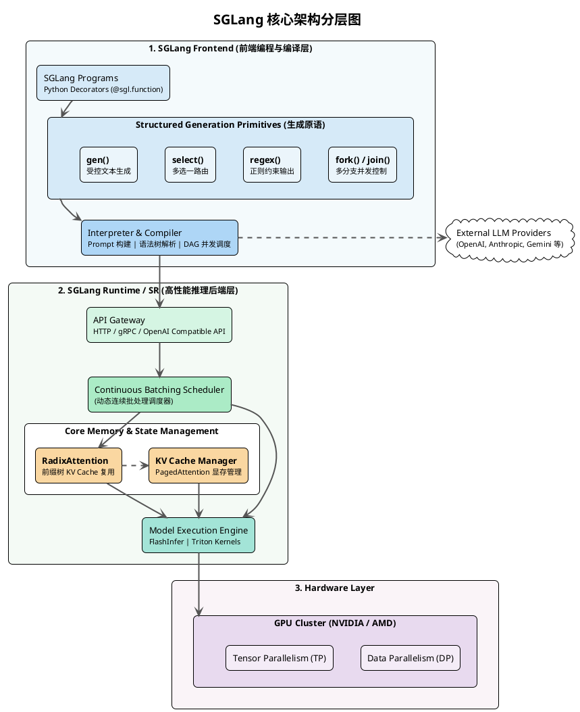

```plantuml
@startuml
!theme plain

skinparam DefaultFontName Helvetica
skinparam DefaultFontSize 13
skinparam RoundCorner 12
skinparam Nodesep 40
skinparam Ranksep 50
skinparam Shadowing false
skinparam ArrowColor #555555
skinparam ArrowThickness 2

title <size:20><b>SGLang 核心架构分层图</b></size>

cloud "External LLM Providers\n<size:11>(OpenAI, Anthropic, Gemini 等)</size>" as ExternalAPI #FFFFFF

rectangle "1. SGLang Frontend (前端编程与编译层)" as FrontendLayer #F4FAFC {
    
    rectangle "SGLang Programs\n<size:11>Python Decorators (@sgl.function)</size>" as Program #D6EAF8
    
    rectangle "Structured Generation Primitives (生成原语)" as Primitives #D6EAF8 {
        rectangle "<b>gen()</b>\n<size:11>受控文本生成</size>" as P_Gen #EBF5FB
        rectangle "<b>select()</b>\n<size:11>多选一路由</size>" as P_Sel #EBF5FB
        rectangle "<b>regex()</b>\n<size:11>正则约束输出</size>" as P_Reg #EBF5FB
        rectangle "<b>fork() / join()</b>\n<size:11>多分支并发控制</size>" as P_Fork #EBF5FB
        
        P_Gen -[hidden]right- P_Sel
        P_Sel -[hidden]right- P_Reg
        P_Reg -[hidden]right- P_Fork
    }

    rectangle "Interpreter & Compiler\n<size:11>Prompt 构建 | 语法树解析 | DAG 并发调度</size>" as Compiler #AED6F6
    
    Program --> Primitives
    Primitives --> Compiler
}

rectangle "2. SGLang Runtime / SR (高性能推理后端层)" as BackendLayer #F4FAF5 {
    
    rectangle "API Gateway\n<size:11>HTTP / gRPC / OpenAI Compatible API</size>" as APIGateway #D5F5E3
    
    rectangle "Continuous Batching Scheduler\n<size:11>(动态连续批处理调度器)</size>" as Scheduler #ABEBC6
    
    rectangle "Core Memory & State Management" as Memory #FFFFFF {
        rectangle "<b>RadixAttention</b>\n<size:11>前缀树 KV Cache 复用</size>" as Radix #FAD7A1
        rectangle "<b>KV Cache Manager</b>\n<size:11>PagedAttention 显存管理</size>" as KVCache #FAD7A1
        Radix .right.> KVCache
    }
    
    rectangle "Model Execution Engine\n<size:11>FlashInfer | Triton Kernels</size>" as Engine #A3E4D7
    
    APIGateway --> Scheduler
    Scheduler --> Radix
    Scheduler --> Engine
    Radix --> Engine
    KVCache --> Engine
}

rectangle "3. Hardware Layer" as HardwareLayer #FAF4F8 {
    rectangle "GPU Cluster (NVIDIA / AMD)" as GPU #E8DAEF {
        rectangle "Tensor Parallelism (TP)" as TP #F4ECF7
        rectangle "Data Parallelism (DP)" as DP #F4ECF7
        TP -[hidden]right- DP
    }
}

Compiler -down-> APIGateway
Compiler .right.> ExternalAPI
Engine -down-> GPU

@enduml
```
