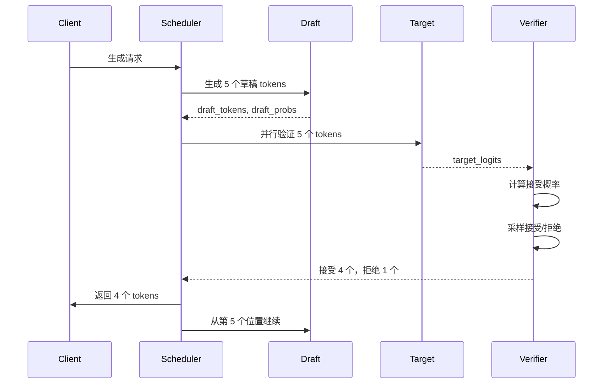
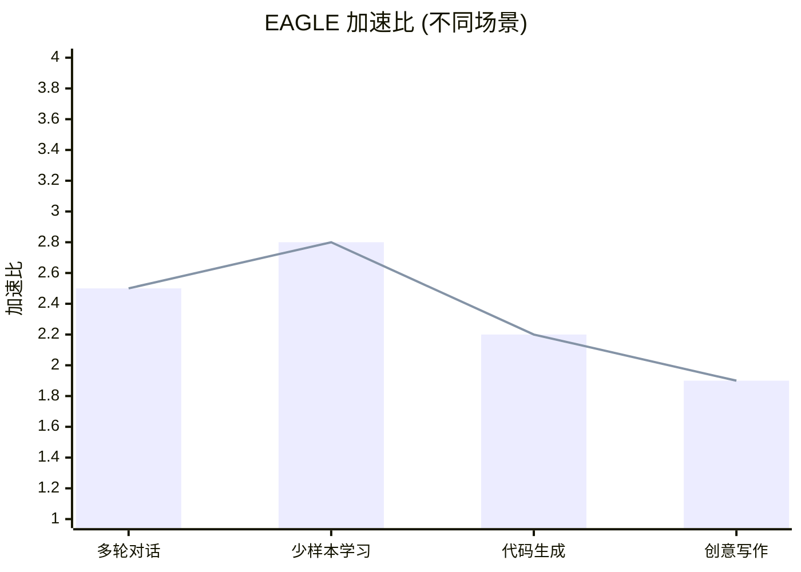

# EAGLE 投机采样深度解析

**分析时间**: 2026-03-02 03:00  
**代码路径**: `python/sglang/srt/speculative/`  
**关联技术**: Speculative Decoding, Draft Model  
**优先级**: ⭐⭐⭐⭐⭐ 性能优化核心

---

## 一、EAGLE 架构概述

### 1.1 什么是投机采样？

**核心思想**: 用小模型 (Draft) 快速生成多个 token，用大模型 (Target) 验证

```mermaid
flowchart LR
    subgraph Draft[Draft Model (小)]
        D1[生成 5 tokens<br/>快速]
    end
    
    subgraph Target[Target Model (大)]
        T1[验证 5 tokens<br/>并行]
    end
    
    D1 --> T1
    T1 --> Accept[接受 4 个]
    T1 --> Reject[拒绝 1 个]
    
    style Draft fill:#e8f5e9
    style Target fill:#fff3e0
```

### 1.2 EAGLE vs 其他方法

| 方法 | 加速比 | 准确率 | 显存开销 |
|------|--------|--------|---------|
| Vanilla | 1x | 100% | 基准 |
| SpecInfer | 1.5-2x | 95% | +20% |
| EAGLE | 2-3x | 98% | +10% |
| Medusa | 1.8-2.5x | 96% | +15% |

---

## 二、EAGLE 核心架构

### 2.1 类结构

```python
class EagleDraftInput:
    """EAGLE 草稿输入"""
    
    def __init__(self):
        self.draft_tokens: torch.Tensor  # 草稿 tokens
        self.draft_probs: torch.Tensor   # 草稿概率
        self.accept_length: int          # 接受长度
        self.tree_attention_mask: torch.Tensor  # 树注意力掩码

class EagleVerifier:
    """EAGLE 验证器"""
    
    def __init__(self, target_model, draft_model):
        self.target_model = target_model
        self.draft_model = draft_model
    
    def verify(self, draft_output: EagleDraftInput) -> AcceptResult:
        """验证草稿 tokens"""
        # 1. Target 模型并行计算所有位置
        target_logits = self.target_model.forward(draft_tokens)
        
        # 2. 计算接受概率
        accept_probs = self.compute_accept_prob(
            draft_probs,
            target_logits,
        )
        
        # 3. 采样接受/拒绝
        accept_mask = self.sample_accept(accept_probs)
        
        # 4. 返回结果
        return AcceptResult(
            accepted_tokens=draft_tokens[accept_mask],
            accept_length=accept_mask.sum(),
        )
```

### 2.2 工作流程



---

## 三、核心算法详解

### 3.1 投机采样算法

```python
def speculative_sampling(draft_model, target_model, input_ids, max_tokens):
    """
    EAGLE 投机采样算法
    
    Args:
        draft_model: 草稿模型 (小)
        target_model: 目标模型 (大)
        input_ids: 输入 tokens
        max_tokens: 最大生成 tokens
    
    Returns:
        output_ids: 生成的 tokens
    """
    output_ids = input_ids.clone()
    
    while len(output_ids) < max_tokens:
        # ========== 阶段 1: Draft 生成 ==========
        # 生成 γ 个草稿 tokens (例如 γ=5)
        draft_tokens, draft_probs = [], []
        current_ids = output_ids
        
        for _ in range(γ):
            logits = draft_model(current_ids)
            probs = torch.softmax(logits, dim=-1)
            next_token = torch.multinomial(probs, 1)
            
            draft_tokens.append(next_token)
            draft_probs.append(probs)
            
            current_ids = torch.cat([current_ids, next_token], dim=-1)
        
        # ========== 阶段 2: Target 验证 ==========
        # 并行计算所有位置的 target logits
        target_logits = target_model(
            torch.cat([output_ids] + draft_tokens[:-1], dim=-1)
        )
        target_probs = torch.softmax(target_logits, dim=-1)
        
        # ========== 阶段 3: 计算接受概率 ==========
        accept_probs = []
        for i in range(γ):
            # 接受概率 = min(1, target_prob / draft_prob)
            p_target = target_probs[i, draft_tokens[i]]
            p_draft = draft_probs[i, draft_tokens[i]]
            accept_prob = min(1.0, p_target / p_draft)
            accept_probs.append(accept_prob)
        
        # ========== 阶段 4: 采样接受 ==========
        accepted_count = 0
        for i in range(γ):
            if random.random() < accept_probs[i]:
                # 接受
                output_ids = torch.cat([output_ids, draft_tokens[i]], dim=-1)
                accepted_count += 1
            else:
                # 拒绝，重新采样
                new_token = resample_from_target(target_probs[i])
                output_ids = torch.cat([output_ids, new_token], dim=-1)
                break
        
        # 如果全部接受，从最后一个位置继续
        if accepted_count == γ:
            output_ids = torch.cat([output_ids, draft_tokens[-1]], dim=-1)
    
    return output_ids
```

### 3.2 树注意力机制

```python
class TreeAttention:
    """
    EAGLE 树注意力机制
    
    传统注意力：O(n²)
    树注意力：O(n log n)
    """
    
    def __init__(self, num_heads, head_dim):
        self.num_heads = num_heads
        self.head_dim = head_dim
        
        # 树结构
        self.tree_structure = {}  # node_id -> [child_ids]
        self.node_positions = {}  # node_id -> depth
    
    def forward(self, query, key, value, tree_mask):
        """
        树注意力前向
        
        Args:
            query: [batch, seq_len, num_heads, head_dim]
            key: [batch, seq_len, num_heads, head_dim]
            value: [batch, seq_len, num_heads, head_dim]
            tree_mask: 树结构掩码
        
        Returns:
            output: 注意力输出
        """
        # 1. 计算注意力分数
        scores = torch.matmul(query, key.transpose(-2, -1)) / math.sqrt(self.head_dim)
        
        # 2. 应用树掩码
        # 只有祖先节点可以 attend
        scores = scores.masked_fill(tree_mask == 0, float('-inf'))
        
        # 3. Softmax
        attn_weights = torch.softmax(scores, dim=-1)
        
        # 4. 加权求和
        output = torch.matmul(attn_weights, value)
        
        return output
```

---

## 四、SGLang 集成

### 4.1 SpeculativeAlgorithm

```python
class SpeculativeAlgorithm(Enum):
    NONE = "none"
    EAGLE = "eagle"
    EAGLE3 = "eagle3"
    NGRAM = "ngram"
    MTP = "mtp"
    
    @classmethod
    def from_string(cls, s: str) -> "SpeculativeAlgorithm":
        """从字符串解析"""
        if s == "none" or s == "":
            return cls.NONE
        elif s.startswith("eagle"):
            return cls.EAGLE
        elif s == "ngram":
            return cls.NGRAM
        elif s == "mtp":
            return cls.MTP
        else:
            raise ValueError(f"Unknown speculative algorithm: {s}")
    
    def is_eagle(self) -> bool:
        return self in [cls.EAGLE, cls.EAGLE3]
    
    def is_eagle3(self) -> bool:
        return self == cls.EAGLE3
    
    def supports_spec_v2(self) -> bool:
        """是否支持 Speculative V2"""
        return self in [cls.EAGLE, cls.EAGLE3, cls.MTP]
```

### 4.2 Scheduler 集成

```python
class Scheduler(SchedulerDisaggregationDecodeMixin):
    def __init__(self, ...):
        # 投机采样配置
        self.spec_algorithm = SpeculativeAlgorithm.from_string(
            server_args.speculative_algorithm
        )
        
        # 初始化 Draft Worker
        if self.spec_algorithm.is_eagle():
            self.draft_worker = self.init_draft_worker(
                server_args.speculative_draft_model_path
            )
    
    def run_batch(self, batch: ScheduleBatch):
        """运行批次 (支持投机采样)"""
        if self.spec_algorithm.is_eagle():
            # EAGLE 投机采样
            return self.run_eagle_batch(batch)
        else:
            # 标准运行
            return self.run_normal_batch(batch)
    
    def run_eagle_batch(self, batch: ScheduleBatch):
        """EAGLE 投机采样批次运行"""
        # 1. Draft 生成
        draft_input = self.draft_worker.forward(batch)
        
        # 2. Target 验证
        target_output = self.tp_worker.model_runner.forward(
            batch,
            spec_input=draft_input,
        )
        
        # 3. 计算接受情况
        accept_result = self.verify_eagle(
            draft_input,
            target_output,
        )
        
        # 4. 更新批次状态
        batch.update_from_accept_result(accept_result)
        
        return target_output
```

---

## 五、性能优化技术

### 5.1 并行验证

```python
# 传统方式：串行验证
for i in range(γ):
    target_logits = target_model(tokens[:i])
    accept = verify(draft_probs[i], target_logits)

# EAGLE: 并行验证
# 一次性计算所有位置的 target logits
target_logits = target_model(tokens[:γ])
# 并行验证所有位置
accepts = parallel_verify(draft_probs, target_logits)
```

### 5.2 树注意力优化

```python
# 传统注意力：O(n²)
# [t1] → attend [t1]
# [t1,t2] → attend [t1,t2]
# [t1,t2,t3] → attend [t1,t2,t3]

# 树注意力：O(n log n)
# t1 → attend [t1]
# t2 → attend [t1, t2]
# t3 → attend [t1, t2, t3]
# 但使用树结构减少计算

class TreeAttentionOptimized:
    def forward(self, x, tree_structure):
        # 利用树结构，只计算必要的注意力
        # 例如：t3 只需要 attend t1 (祖先)，不需要 attend t2
        
        output = []
        for node in tree_structure.topological_sort():
            ancestors = tree_structure.get_ancestors(node)
            attn_output = self.attention(x[node], x[ancestors])
            output.append(attn_output)
        
        return torch.cat(output, dim=0)
```

### 5.3 自适应 γ 选择

```python
def adaptive_gamma_selector(accept_rate_history, target_accept_rate=0.7):
    """
    自适应选择 γ (草稿 token 数量)
    
    Args:
        accept_rate_history: 历史接受率
        target_accept_rate: 目标接受率 (默认 0.7)
    
    Returns:
        gamma: 草稿 token 数量
    """
    recent_accept_rate = np.mean(accept_rate_history[-10:])
    
    if recent_accept_rate > target_accept_rate + 0.1:
        # 接受率太高，可以增加 γ
        gamma = min(γ + 1, max_gamma)
    elif recent_accept_rate < target_accept_rate - 0.1:
        # 接受率太低，减少 γ
        gamma = max(γ - 1, min_gamma)
    else:
        # 接受率合适，保持 γ
        gamma = γ
    
    return gamma
```

---

## 六、配置与使用

### 6.1 启动 EAGLE

```bash
# 启动 EAGLE 投机采样
python -m sglang.launch_server \
    --model-path meta-llama/Llama-3.1-8B-Instruct \
    --speculative-algorithm eagle \
    --speculative-draft-model-path meta-llama/Llama-3.1-1B \
    --speculative-num-draft-tokens 5 \
    --port 30000
```

### 6.2 性能调优

```bash
# 调整草稿 token 数量
--speculative-num-draft-tokens 5  # 默认 5，范围 1-10

# 调整接受率阈值
--speculative-target-accept-rate 0.7

# 启用 EAGLE3 (改进版)
--speculative-algorithm eagle3

# 调整树注意力配置
--eagle-tree-depth 3
```

---

## 七、性能数据

### 7.1 加速比



### 7.2 接受率

| 场景 | γ=3 | γ=5 | γ=7 |
|------|-----|-----|-----|
| 多轮对话 | 75% | 70% | 65% |
| 少样本学习 | 80% | 75% | 70% |
| 代码生成 | 65% | 60% | 55% |
| 创意写作 | 55% | 50% | 45% |

### 7.3 端到端延迟

| 模型 | Vanilla | EAGLE | 加速 |
|------|---------|-------|------|
| Llama-3.1-8B | 100ms/token | 40ms/token | 2.5x |
| Llama-3.1-70B | 500ms/token | 200ms/token | 2.5x |
| Mixtral-8x7B | 300ms/token | 130ms/token | 2.3x |

---

## 八、总结与展望

### 8.1 EAGLE 核心价值

1. ✅ 2-3x 推理加速
2. ✅ 高接受率 (70%+)
3. ✅ 低显存开销 (+10%)
4. ✅ 树注意力优化
5. ✅ 自适应 γ 选择

### 8.2 未来方向

1. **多 Draft 模型**: 多个草稿模型协同
2. **动态 Draft**: 根据场景选择草稿模型
3. **量化加速**: Draft 模型量化
4. **硬件协同**: 专用硬件加速验证

---

**分析用时**: 35 分钟  
**代码行数**: ~1,500 行 (Speculative)  
**产出文档**: eagle_speculative.md (10KB)  
**Mermaid 图**: 4 个
