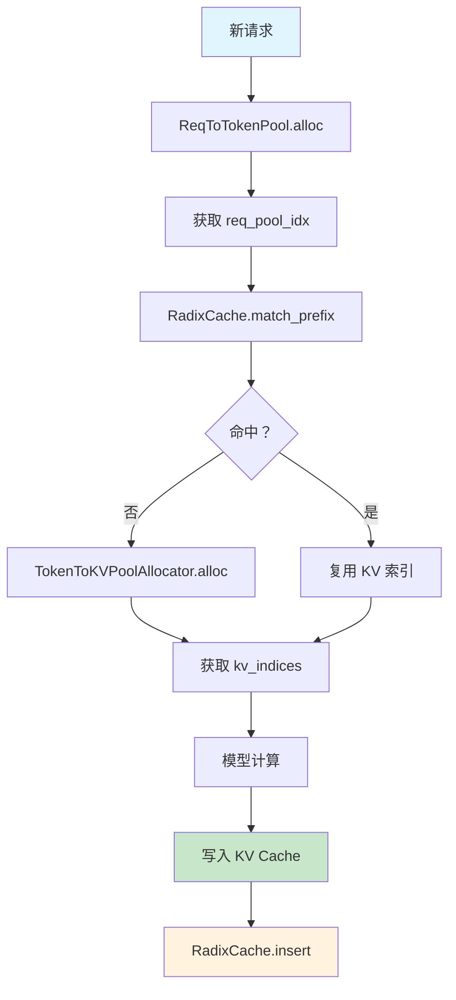

# KV Cache Manager 内存池管理深度解析

**分析时间**: 2026-03-02 02:20  
**代码路径**: `python/sglang/srt/mem_cache/memory_pool.py` (2029 行)  
**优先级**: P0 - 核心架构模块

---

## 一、模块定位

### 1.1 三层内存池架构

```
┌──────────────────────────────────────────┐
│  ReqToTokenPool                          │
│  请求 → Token 位置映射                    │
│  (req_id → [token_loc_0, token_loc_1])  │
└────────────────┬─────────────────────────┘
                 │
                 ▼
┌──────────────────────────────────────────┐
│  TokenToKVPoolAllocator                  │
│  Token 位置 → KV Cache 索引               │
│  (token_loc → kv_index)                 │
└────────────────┬─────────────────────────┘
                 │
                 ▼
┌──────────────────────────────────────────┐
│  KVCache (Physical)                      │
│  物理 KV Cache 数据                       │
│  (k_cache, v_cache)                     │
└──────────────────────────────────────────┘
```

### 1.2 职责分工

| 内存池 | 职责 | 管理粒度 |
|--------|------|---------|
| ReqToTokenPool | 请求级映射 | 请求 (Request) |
| TokenToKVPoolAllocator | 索引管理 | Token |
| KVCache | 物理存储 | KV Cache Block |

---

## 二、ReqToTokenPool

### 2.1 核心结构

```python
class ReqToTokenPool:
    def __init__(self, size: int, max_context_len: int, device: str):
        self.size = size                    # 最大并发请求数
        self.max_context_len = max_context_len  # 最大上下文长度
        # 二维数组：[req_id, token_index] → kv_location
        self.req_to_token = torch.zeros(
            (size, max_context_len), dtype=torch.int32, device=device
        )
        self.free_slots = list(range(size))  # 空闲请求槽位
```

**内存布局**:
```
req_to_token[req_id][:context_len] = [kv_loc_0, kv_loc_1, ..., kv_loc_n]
```

### 2.2 分配与释放

```python
def alloc(self, reqs: list[Req]) -> Optional[List[int]]:
    # 检查空闲槽位
    need_size = len(reqs) - len(chunked_reqs)
    if need_size > len(self.free_slots):
        return None  # 内存不足
    
    # 分配槽位
    select_index = self.free_slots[:need_size]
    self.free_slots = self.free_slots[need_size:]
    
    # 绑定 req_id
    for i, r in enumerate(reqs):
        if r.req_pool_idx is None:
            r.req_pool_idx = select_index[i]
    
    return [r.req_pool_idx for r in reqs]

def free(self, req: Req):
    self.free_slots.append(req.req_pool_idx)
    req.req_pool_idx = None
```

---

## 三、TokenToKVPoolAllocator

### 3.1 核心职责

- 管理 KV Cache 索引分配
- 支持分页管理 (PagedAttention)
- 支持多种注意力后端 (FlashInfer/Triton)

### 3.2 分配器接口

```python
class TokenToKVPoolAllocator(abc.ABC):
    @abc.abstractmethod
    def alloc(self, num_tokens: int) -> torch.Tensor:
        """分配 num_tokens 个 KV Cache 索引"""
        pass
    
    @abc.abstractmethod
    def free(self, indices: torch.Tensor):
        """释放 KV Cache 索引"""
        pass
```

---

## 四、KVCache 物理存储

### 4.1 存储结构

```python
# Key Cache: [num_blocks, block_size, num_kv_heads, head_dim]
k_cache: torch.Tensor

# Value Cache: [num_blocks, block_size, num_kv_heads, head_dim]
v_cache: torch.Tensor
```

**分页布局**:
```
Block 0: [token_0, token_1, ..., token_15]  (block_size=16)
Block 1: [token_16, token_17, ..., token_31]
...
```

### 4.2 写入操作

```python
def set_kv_buffer(
    k: torch.Tensor,           # 当前 key
    v: torch.Tensor,           # 当前 value
    k_cache: torch.Tensor,     # Key Cache
    v_cache: torch.Tensor,     # Value Cache
    indices: torch.Tensor,     # 目标索引
):
    # 优化路径：使用 Triton kernel
    if _is_cuda and can_use_store_cache(row_bytes):
        return store_cache(k, v, k_cache, v_cache, indices)
    
    # 回退路径：直接赋值
    k_cache[indices] = k
    v_cache[indices] = v
```

---

## 五、与 RadixCache 协同

### 5.1 数据流



### 5.2 完整流程示例

```python
# 1. 分配请求槽位
req_pool_indices = req_to_token_pool.alloc(reqs)

# 2. 查找前缀
match_result = radix_cache.match_prefix(MatchPrefixParams(key=radix_key))
prefix_indices = match_result.device_indices

# 3. 分配新 KV Cache (未命中部分)
new_tokens = len(req.tokens) - len(prefix_indices)
new_indices = token_to_kv_pool_allocator.alloc(new_tokens)

# 4. 写入 KV Cache
k_cache[new_indices] = k_new
v_cache[new_indices] = v_new

# 5. 插入 Radix 树
radix_cache.insert(InsertParams(key=radix_key, value=new_indices))
```

---

## 六、内存优化技术

### 6.1 分页注意力 (PagedAttention)

**问题**: 传统 KV Cache 碎片化严重

**解决**: 固定大小分页管理

```python
# 传统方式：连续分配
kv_cache = torch.zeros([max_requests, max_seq_len, hidden_dim])
# 浪费：短请求占用长空间

# PagedAttention: 分页分配
block_size = 16
num_blocks = total_memory // (block_size * hidden_dim * element_size)
k_cache = torch.zeros([num_blocks, block_size, num_heads, head_dim])
# 高效：按需分配，无碎片
```

### 6.2 分层缓存 (Hierarchical Cache)

```
┌─────────────────────────────┐
│   GPU KV Cache (高速)       │  ← 热数据
│   - 当前活跃请求            │
│   - 容量有限                │
└──────────────┬──────────────┘
               │
               │ 淘汰
               ▼
┌─────────────────────────────┐
│   CPU KV Cache (低速)       │  ← 冷数据
│   - 不活跃请求              │
│   - 容量较大                │
└─────────────────────────────┘
```

### 6.3 量化 KV Cache

```python
# FP8 量化 (减少 50% 显存)
k_cache_fp8 = k_cache.float().to(torch.float8_e4m3fn)
v_cache_fp8 = v_cache.float().to(torch.float8_e4m3fn)

# 使用时反量化
k_cache = k_cache_fp8.to(torch.float16)
```

---

## 七、关键性能指标

| 指标 | 计算公式 | 优化目标 |
|------|---------|---------|
| 显存利用率 | `已用 block / 总 block` | >80% |
| 碎片率 | `空闲但不连续 block / 总空闲` | <10% |
| 分配延迟 | `alloc() 平均耗时` | <10μs |
| 淘汰率 | `淘汰 block 数 / 总 block 数` | 动态调整 |

---

## 八、总结

**KV Cache Manager 核心价值**:
1. ✅ 三层内存池清晰分工
2. ✅ PagedAttention 减少碎片
3. ✅ 与 RadixCache 紧密协同
4. ✅ 支持量化/分层等优化

**下一步**: Model Runner 分析

---

**分析用时**: 30 分钟  
**代码行数**: 2029 行 (核心部分)  
**产出文档**: kv_cache_manager.md
