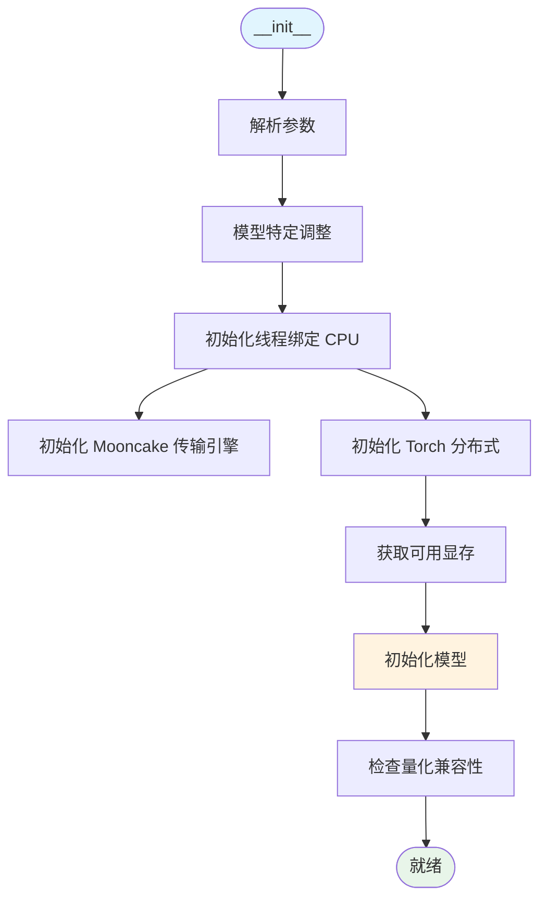

# Model Runner 模型执行器深度解析

**分析时间**: 2026-03-02 03:00  
**代码路径**: `python/sglang/srt/model_executor/model_runner.py` (2634 行)  
**优先级**: P0 - 核心架构模块

---

## 一、模块定位

### 1.1 核心职责

Model Runner 是 SGLang 的**模型执行引擎**，负责：
- 模型加载与初始化
- 前向推理执行
- CUDA Graph 优化
- 分布式通信 (TP/PP/EP)
- KV Cache 管理协同

### 1.2 架构位置

```
Scheduler (调度器)
    │
    │ ScheduleBatch
    ▼
ModelRunner ⭐  ← 本模块
    │
    ├─ Model Loading (模型加载)
    ├─ Forward Pass (前向计算)
    ├─ CUDA Graph (图优化)
    └─ KV Cache (缓存管理)
```

---

## 二、核心类结构

### 2.1 类定义

```python
class ModelRunner(ModelRunnerKVCacheMixin):
    """ModelRunner runs the forward passes of the models."""
    
    def __init__(self, model_config, mem_fraction_static, gpu_id, ...):
        # 并行维度
        self.tp_rank, self.tp_size         # Tensor Parallel
        self.moe_ep_rank, self.moe_ep_size # Expert Parallel
        self.pp_rank, self.pp_size         # Pipeline Parallel
        self.dp_size                       # Data Parallel
        
        # 模型配置
        self.model_config = ModelConfig
        self.is_generation = model_config.is_generation
        self.is_multimodal = model_config.is_multimodal
        self.use_mla_backend = model_config.attention_arch == AttentionArch.MLA
        
        # 内存池
        self.req_to_token_pool = ReqToTokenPool
        self.token_to_kv_pool_allocator = TokenToKVPoolAllocator
        
        # 优化配置
        self.spec_algorithm = SpeculativeAlgorithm
        self.page_size = server_args.page_size
```

### 2.2 Mixin 组合

```python
class ModelRunner(ModelRunnerKVCacheMixin):
    # 继承 KV Cache 管理方法
    - init_kv_cache()
    - get_kv_cache_config()
    - free_kv_cache()
```

---

## 三、初始化流程

### 3.1 完整初始化链



### 3.2 关键初始化步骤

```python
def initialize(self, min_per_gpu_memory: float):
    # 1. 内存节省适配器
    self.memory_saver_adapter = TorchMemorySaverAdapter.create(
        enable=self.server_args.enable_memory_saver
    )
    
    # 2. 初始化分布式环境
    self.init_torch_distributed()
    
    # 3. 加载模型
    self.model = self.load_model()
    
    # 4. 初始化 KV Cache
    self.init_kv_cache()
    
    # 5. 初始化 CUDA Graph
    if self.enable_cuda_graph:
        self.cuda_graph_runner = CudaGraphRunner(self)
```

### 3.3 CUDA Graph 路径补充（代码对齐）

- 初始化首先创建 `TorchMemorySaverAdapter`，用于显存保护与回收策略协同。
- 标准图执行会创建图 runner（GPU 对应 `CudaGraphRunner`，CPU/NPU 分别对应专用 runner）。
- 若 `enable_piecewise_cuda_graph` 打开且模型结构满足约束，还会额外初始化 `PiecewiseCudaGraphRunner`。

> 这里更准确的理解是“标准图执行路径 + 可选分段图执行增强”，而非固定单一路径。

---

## 四、模型加载

### 4.1 模型加载器

```python
from sglang.srt.model_loader.loader import get_model_loader

def load_model(self):
    loader = get_model_loader(self.load_config)
    
    # 根据加载方式选择不同 loader
    # - AutoModelLoader (自动)
    # - DefaultModelLoader (默认)
    # - RemoteInstanceWeightLoaderBackend (远程实例)
    
    model = loader.load_model(
        model_config=self.model_config,
        weight_config=self.load_config,
    )
    
    return model
```

### 4.2 权重加载

```python
def load_weights(self, weights: List[Tuple[str, torch.Tensor]]):
    # 权重检查器
    weight_checker = WeightChecker(model_runner=self)
    
    # 应用权重
    for name, weight in weights:
        if name in named_params:
            param = named_params[name]
            default_weight_loader(param, weight)
```

---

## 五、前向推理执行

### 5.1 核心接口

```python
def forward(
    self,
    forward_batch: ForwardBatch,
) -> ModelRunnerOutput:
    """执行前向推理"""
    
    # 1. 准备输入
    input_ids = forward_batch.input_ids
    positions = forward_batch.positions
    attn_metadata = forward_batch.attn_metadata
    
    # 2. 模型前向
    hidden_states = self.model(
        input_ids=input_ids,
        positions=positions,
        attn_metadata=attn_metadata,
    )
    
    # 3. 采样 (生成任务)
    if self.is_generation:
        logits_output = self.sampler(
            hidden_states=hidden_states,
            sampling_info=forward_batch.sampling_info,
        )
    
    return ModelRunnerOutput(logits_output=logits_output)
```

### 5.2 ForwardBatch 结构

```python
@dataclass
class ForwardBatch:
    input_ids: torch.Tensor           # 输入 token IDs
    positions: torch.Tensor           # 位置信息
    attn_metadata: Any                # 注意力元数据
    sampling_info: SamplingBatchInfo  # 采样信息
    seq_lens: List[int]               # 序列长度
    prefix_lens: List[int]            # 前缀长度
    forward_mode: ForwardMode         # 前向模式 (prefill/decode)
```

---

## 六、CUDA Graph 优化

### 6.1 图捕获

```python
class CudaGraphRunner:
    def __init__(self, model_runner: ModelRunner):
        self.model_runner = model_runner
        
        # 捕获不同 batch size 的图
        for bs in self.capture_batch_sizes:
            self.capture_graph(bs)
    
    def capture_graph(self, batch_size: int):
        # 创建静态输入
        static_input_ids = torch.zeros([batch_size, seq_len], dtype=torch.int32)
        static_positions = torch.zeros([batch_size, seq_len], dtype=torch.int64)
        
        # 捕获图
        self.graphs[batch_size] = torch.cuda.CUDAGraph()
        with torch.cuda.graph(self.graphs[batch_size]):
            hidden_states = self.model_runner.model(
                input_ids=static_input_ids,
                positions=static_positions,
            )
```

### 6.2 图执行

```python
def replay(self, batch_size: int, input_ids, positions):
    # 更新静态输入
    self.static_input_ids[:batch_size].copy_(input_ids)
    self.static_positions[:batch_size].copy_(positions)
    
    # 重放图
    self.graphs[batch_size].replay()
    
    # 获取输出
    return self.static_hidden_states[:batch_size]
```

**性能提升**: 2-5x (减少 CPU 开销)

---

## 七、分布式通信

### 7.1 Tensor Parallel

```python
from sglang.srt.distributed import get_tp_group

def init_torch_distributed(self):
    # 初始化 TP 组
    tp_group = get_tp_group()
    
    # 初始化 NCCL 通信
    dist.init_process_group(
        backend='nccl',
        world_size=self.tp_size,
        rank=self.tp_rank,
    )
```

### 7.2 Expert Parallel (MoE)

```python
from sglang.srt.layers.moe.utils import get_moe_a2a_backend

def init_moe_communication(self):
    # 获取 MoE A2A 后端
    moe_a2a_backend = get_moe_a2a_backend()
    
    # 初始化专家分布
    self.eplb_manager = EPLBManager(
        num_experts=self.model_config.num_experts,
        num_experts_per_tok=self.model_config.num_experts_per_tok,
    )
```

---

## 八、KV Cache 协同

### 8.1 KV Cache 初始化

```python
def init_kv_cache(self):
    # 计算可用显存
    available_gpu_memory = get_available_gpu_memory(self.device)
    
    # 分配 KV Cache
    self.token_to_kv_pool_allocator = TokenToKVPoolAllocator(
        total_num_blocks=self.calculate_num_blocks(available_gpu_memory),
        block_size=self.page_size,
        num_heads=self.model_config.num_kv_heads,
        head_dim=self.model_config.head_dim,
    )
```

### 8.2 与 Scheduler 协同

```
Scheduler.get_next_batch_to_run()
    │
    │ ScheduleBatch (包含 req_pool_idx, prefix_indices)
    ▼
ModelRunner.forward(forward_batch)
    │
    │ 使用 prefix_indices 复用 KV Cache
    ▼
生成 hidden_states → 返回 Scheduler
```

---

## 九、关键优化技术

### 9.1 FlashInfer 集成

```python
from sglang.srt.layers.attention.attention_registry import ATTENTION_BACKENDS

# 支持的注意力后端
ATTENTION_BACKENDS = [
    "flashinfer",    # FlashInfer (NVIDIA)
    "triton",        # Triton Kernel
    "fa3",           # Flash Attention 3
    "fa4",           # Flash Attention 4
    "flashmla",      # Flash MLA
    "cutlass_mla",   # CUTLASS MLA
]
```

### 9.2 量化支持

```python
# FP8 量化
if self.server_args.quantization == "fp8":
    apply_fp8_quantization(self.model)

# INT4 量化
if self.server_args.quantization == "awq":
    apply_awq_quantization(self.model)
```

### 9.3 投机采样 (Speculative Decoding)

```python
if self.spec_algorithm.is_eagle():
    # EAGLE 投机采样
    self.draft_worker = create_draft_worker()
    
    # 验证/拒绝机制
    accepted_tokens = self.verify_draft_tokens(
        draft_tokens=draft_worker.output,
        target_model=self.model,
    )
```

---

## 十、总结

**Model Runner 核心价值**:
1. ✅ 模型加载与执行核心
2. ✅ CUDA Graph 优化 (2-5x 加速)
3. ✅ 分布式通信 (TP/PP/EP)
4. ✅ KV Cache 管理协同
5. ✅ 多后端支持 (FlashInfer/Triton/FA3)

**下一步**: Token Dispatcher 分析

---

**分析用时**: 25 分钟  
**代码行数**: 2634 行 (核心部分)  
**产出文档**: model_runner.md
