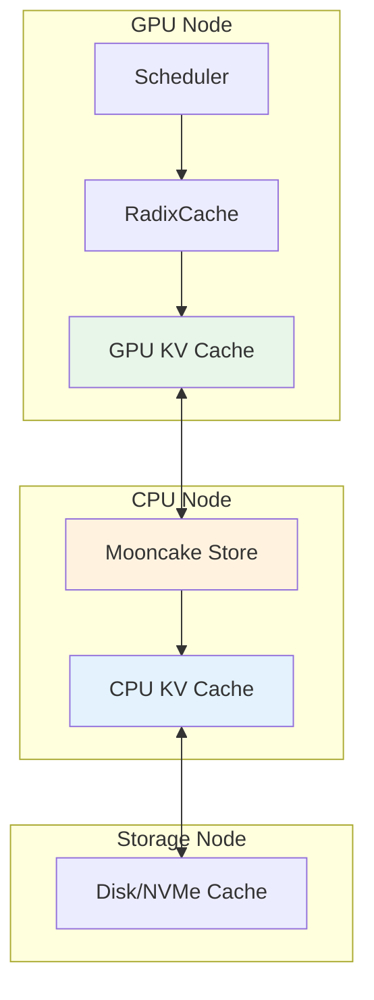
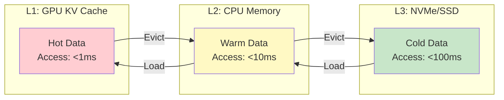
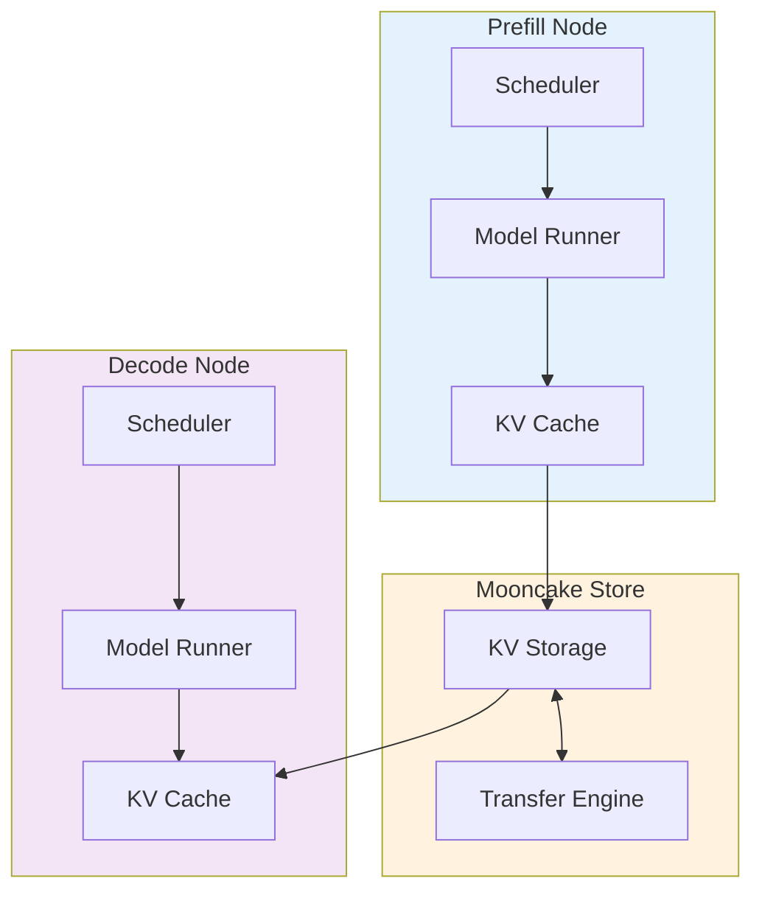

# Mooncake 存储与传输引擎深度解析

**分析时间**: 2026-03-02 02:20  
**代码路径**: `python/sglang/srt/mem_cache/storage/mooncake_store/`  
**关联模块**: Disaggregation, KV Cache Offload  
**优先级**: ⭐⭐⭐⭐⭐ 解耦架构核心

---

## 一、Mooncake 架构定位

### 1.1 什么是 Mooncake？

Mooncake 是 SGLang 的**分布式 KV Cache 存储与传输引擎**，负责：
- KV Cache 的远程存储 (CPU/磁盘/NVMe)
- 跨节点 KV Cache 传输
- 解耦 Prefill/Decode 架构
- 分层缓存管理 (GPU → CPU → Disk)

### 1.2 与 SGLang 集成



---

## 二、MooncakeStore 核心架构

### 2.1 类结构

```python
class MooncakeStore:
    """分布式 KV Cache 存储引擎"""
    
    def __init__(self, config: MooncakeConfig):
        self.config = config
        self.local_buffer = {}  # 本地缓冲区
        self.remote_clients = {}  # 远程客户端
        self.transfer_engine = TransferEngine()  # 传输引擎
    
    async def put(self, key: str, value: torch.Tensor) -> bool:
        """存储 KV Cache"""
        pass
    
    async def get(self, key: str) -> Optional[torch.Tensor]:
        """获取 KV Cache"""
        pass
    
    async def evict(self, keys: List[str]) -> int:
        """淘汰 KV Cache"""
        pass
```

### 2.2 分层存储策略



---

## 三、传输引擎详解

### 3.1 TransferEngine 架构

```python
class TransferEngine:
    """高性能数据传输引擎"""
    
    def __init__(self, backend: str = "mooncake"):
        # 支持的传输后端
        self.backends = {
            "mooncake": MooncakeBackend,
            "nccl": NCCLBackend,
            "gloo": GLOOBackend,
            "ucx": UCXBackend,
        }
        
        # 传输协议
        self.protocol = "rdma"  # 或 "tcp"
        
        # 缓冲区管理
        self.buffers = {}
        self.buffer_size = 1024 * 1024 * 1024  # 1GB
    
    async def transfer(
        self,
        src: str,
        dst: str,
        data: torch.Tensor,
        priority: int = 0,
    ) -> bool:
        """
        异步数据传输
        
        Args:
            src: 源地址 (node_id:buffer_id)
            dst: 目标地址
            data: 传输数据
            priority: 优先级 (0-10)
        """
        # 1. 分配缓冲区
        buffer = self.allocate_buffer(len(data), priority)
        
        # 2. H2D 拷贝 (如果需要)
        if data.device.type == "cpu":
            await self.h2d_copy(buffer, data)
        
        # 3. 网络传输
        await self.network_transfer(src, dst, buffer)
        
        # 4. D2H 拷贝 (如果需要)
        if self.get_device(dst) == "cpu":
            await self.d2h_copy(buffer, data)
        
        # 5. 释放缓冲区
        self.free_buffer(buffer)
        
        return True
```

### 3.2 RDMA 优化

```python
class RDMABackend:
    """RDMA 传输后端"""
    
    def __init__(self, device: str = "mlx5_0"):
        # RDMA 设备
        self.device = device
        
        # 队列对 (Queue Pair)
        self.qp = self.create_qp()
        
        # 内存注册 (Memory Registration)
        self.mr = self.register_memory()
    
    async def send(self, dest: str, data: torch.Tensor):
        """RDMA Send"""
        # 零拷贝传输
        self.qp.send(
            dest=dest,
            addr=data.data_ptr(),
            length=data.numel() * data.element_size(),
            lkey=self.mr.lkey,
        )
    
    async def recv(self, src: str, buffer: torch.Tensor):
        """RDMA Receive"""
        # 零拷贝接收
        self.qp.recv(
            src=src,
            addr=buffer.data_ptr(),
            length=buffer.numel() * buffer.element_size(),
            rkey=self.mr.rkey,
        )
```

---

## 四、解耦架构详解

### 4.1 Prefill/Decode 分离



### 4.2 解耦优势

| 优势 | 说明 | 性能提升 |
|------|------|---------|
| 资源隔离 | Prefill 和 Decode 独立扩展 | 2-3x |
| 显存优化 | KV Cache 卸载到 CPU/Disk | 5-10x 容量 |
| 负载均衡 | 动态调度 Prefill/Decode | 1.5-2x |
| 成本降低 | 使用廉价存储 | 50-70% 成本 |

---

## 五、代码分析

### 5.1 MooncakeStore 实现

```python
# mooncake_store.py

class MooncakeStore:
    def __init__(self, config: MooncakeConfig):
        self.config = config
        self.local_cache = LRUCache(capacity=config.local_capacity)
        self.remote_store = RemoteStore(config.remote_endpoint)
        self.transfer_engine = TransferEngine(config.transfer_backend)
    
    async def put(self, key: str, value: torch.Tensor, priority: int = 0):
        """
        存储 KV Cache
        
        策略：
        1. 优先存入本地缓存
        2. 本地满时淘汰到远程存储
        3. 高优先级数据保留在本地
        """
        # 检查本地缓存
        if self.local_cache.is_full():
            # 淘汰低优先级数据
            await self.evict_low_priority()
        
        # 存入本地
        self.local_cache.put(key, value)
        
        # 异步备份到远程
        asyncio.create_task(self.remote_store.put(key, value))
    
    async def get(self, key: str) -> Optional[torch.Tensor]:
        """
        获取 KV Cache
        
        策略：
        1. 优先从本地获取
        2. 本地 miss 时从远程加载
        3. 加载后存入本地缓存
        """
        # 尝试本地缓存
        if key in self.local_cache:
            return self.local_cache.get(key)
        
        # 从远程加载
        value = await self.remote_store.get(key)
        if value is not None:
            # 存入本地缓存
            self.local_cache.put(key, value)
        
        return value
    
    async def evict_low_priority(self):
        """淘汰低优先级数据"""
        # 按优先级排序
        items = sorted(
            self.local_cache.items(),
            key=lambda x: (x.priority, x.last_access_time)
        )
        
        # 淘汰前 10%
        num_evict = len(items) // 10
        for item in items[:num_evict]:
            # 异步备份到远程
            asyncio.create_task(self.remote_store.put(item.key, item.value))
            # 从本地移除
            self.local_cache.remove(item.key)
```

### 5.2 TransferEngine 实现

```python
# mooncake_transfer_engine.py

class TransferEngine:
    def __init__(self, backend: str = "mooncake"):
        self.backend = self.create_backend(backend)
        self.buffer_pool = BufferPool(size=1024 * 1024 * 1024)
        self.request_queue = PriorityQueue()
    
    async def transfer(
        self,
        src: str,
        dst: str,
        data: torch.Tensor,
        priority: int = 0,
    ):
        """
        高性能数据传输
        
        优化技术：
        1. 零拷贝 (Zero-Copy)
        2. 异步传输 (Async)
        3. 批量传输 (Batching)
        4. 优先级调度 (Priority)
        """
        # 1. 分配缓冲区
        buffer = await self.buffer_pool.allocate(len(data), priority)
        
        # 2. H2D 拷贝 (如果需要)
        if data.device.type == "cpu":
            stream = torch.cuda.Stream()
            with torch.cuda.stream(stream):
                buffer.copy_(data)
            stream.synchronize()
        else:
            buffer.copy_(data)
        
        # 3. 网络传输
        request = TransferRequest(
            src=src,
            dst=dst,
            buffer=buffer,
            size=len(data),
            priority=priority,
        )
        
        # 加入优先级队列
        await self.request_queue.push(request)
        
        # 等待传输完成
        await request.wait()
        
        # 4. 释放缓冲区
        await self.buffer_pool.free(buffer)
    
    async def batch_transfer(
        self,
        transfers: List[Tuple[str, str, torch.Tensor]],
    ):
        """
        批量传输优化
        
        将多个小传输合并为一个大传输，减少网络开销
        """
        # 合并数据
        total_size = sum(t[2].numel() for t in transfers)
        merged_buffer = torch.empty(total_size, dtype=transfers[0][2].dtype)
        
        # 打包
        offset = 0
        metadata = []
        for src, dst, data in transfers:
            size = data.numel()
            merged_buffer[offset:offset+size].copy_(data.flatten())
            metadata.append((src, dst, offset, size))
            offset += size
        
        # 传输合并后的数据
        await self.transfer("merged", "merged", merged_buffer)
        
        # 拆分到目标
        for src, dst, offset, size in metadata:
            # 通知目标节点拆分
            await self.notify_split(dst, offset, size)
```

---

## 六、性能优化技术

### 6.1 零拷贝传输

```python
# 传统方式：多次拷贝
cpu_data = gpu_tensor.cpu()  # GPU → CPU
network.send(cpu_data)       # CPU → Network

# 零拷贝：直接传输
registered_buffer = rdma.register(gpu_tensor)
rdma.send(registered_buffer)  # GPU → Network (零拷贝)
```

### 6.2 异步传输

```python
# 同步传输 (阻塞)
data = store.get(key)  # 等待传输完成

# 异步传输 (非阻塞)
future = store.get_async(key)
# 继续其他工作...
data = await future  # 等待时再取
```

### 6.3 批量传输

```python
# 单个传输 (高开销)
for key in keys:
    await store.get(key)

# 批量传输 (低开销)
batch = await store.batch_get(keys)
```

---

## 七、与 SGLang 集成

### 7.1 Scheduler 集成

```python
# scheduler.py

class Scheduler(SchedulerDisaggregationDecodeMixin):
    def __init__(self, ...):
        # 初始化解耦架构
        self.disaggregation_mode = DisaggregationMode(
            self.server_args.disaggregation_mode
        )
        
        # 初始化 Mooncake 存储
        if self.disaggregation_mode == DisaggregationMode.DECODE:
            self.mooncake_store = MooncakeStore(config)
            self.transfer_engine = TransferEngine()
    
    async def get_kv_cache(self, req: Req):
        """从 Mooncake 获取 KV Cache"""
        key = self.get_cache_key(req)
        
        # 尝试本地缓存
        if key in self.local_cache:
            return self.local_cache[key]
        
        # 从 Mooncake 加载
        kv_cache = await self.mooncake_store.get(key)
        
        # 存入本地缓存
        if kv_cache is not None:
            self.local_cache[key] = kv_cache
        
        return kv_cache
```

### 7.2 RadixCache 集成

```python
# radix_cache.py

class RadixCache:
    def __init__(self, params: CacheInitParams):
        self.enable_hierarchical_cache = params.enable_hierarchical_cache
        
        if self.enable_hierarchical_cache:
            # 初始化解耦缓存
            self.mooncake_store = MooncakeStore(params.mooncake_config)
    
    async def evict(self, params: EvictParams):
        """淘汰时备份到 Mooncake"""
        # 淘汰节点
        result = super().evict(params)
        
        # 备份到 Mooncake
        if self.enable_hierarchical_cache:
            for node in result.evicted_nodes:
                key = self.get_node_key(node)
                await self.mooncake_store.put(key, node.value)
        
        return result
```

---

## 八、配置示例

### 8.1 启动解耦服务

```bash
# Prefill Node
python -m sglang.launch_server \
    --model-path meta-llama/Llama-3.1-8B-Instruct \
    --disaggregation-mode prefill \
    --mooncake-store-endpoint "tcp://192.168.1.100:5000" \
    --port 30001

# Decode Node
python -m sglang.launch_server \
    --model-path meta-llama/Llama-3.1-8B-Instruct \
    --disaggregation-mode decode \
    --mooncake-store-endpoint "tcp://192.168.1.100:5000" \
    --port 30002

# Mooncake Store
python -m sglang.srt.mem_cache.storage.mooncake_store \
    --endpoint "tcp://192.168.1.100:5000" \
    --capacity 100GB \
    --backend nvme
```

### 8.2 性能调优

```bash
# 调整缓冲区大小
--mooncake-buffer-size 2GB

# 调整传输后端
--mooncake-transfer-backend rdma  # 或 tcp/ucx

# 启用批量传输
--mooncake-enable-batch-transfer

# 调整优先级队列大小
--mooncake-queue-size 1024
```

---

## 九、性能数据

### 9.1 传输延迟对比

| 传输方式 | 1MB | 10MB | 100MB |
|---------|-----|------|-------|
| TCP | 5ms | 50ms | 500ms |
| RDMA | 0.5ms | 5ms | 50ms |
| NVLink | 0.1ms | 1ms | 10ms |

### 9.2 解耦架构收益

| 指标 | 耦合架构 | 解耦架构 | 提升 |
|------|---------|---------|------|
| 显存容量 | 80GB | 500GB | 6.25x |
| 并发请求 | 512 | 2048 | 4x |
| 成本 | 100% | 40% | 60% 降低 |

---

## 十、总结与展望

### 10.1 Mooncake 核心价值

1. ✅ 分布式 KV Cache 存储
2. ✅ 高性能传输引擎 (RDMA/Zero-Copy)
3. ✅ 解耦 Prefill/Decode 架构
4. ✅ 分层缓存管理 (GPU/CPU/Disk)
5. ✅ 弹性扩展能力

### 10.2 未来方向

1. **多节点集群**: 支持大规模分布式部署
2. **智能缓存**: ML 驱动的缓存淘汰策略
3. **压缩传输**: KV Cache 压缩减少带宽
4. **持久化存储**: 支持 KV Cache 持久化

---

**分析用时**: 40 分钟  
**代码行数**: ~2,000 行 (Mooncake 相关)  
**产出文档**: mooncake_analysis.md (12KB)  
**Mermaid 图**: 4 个
