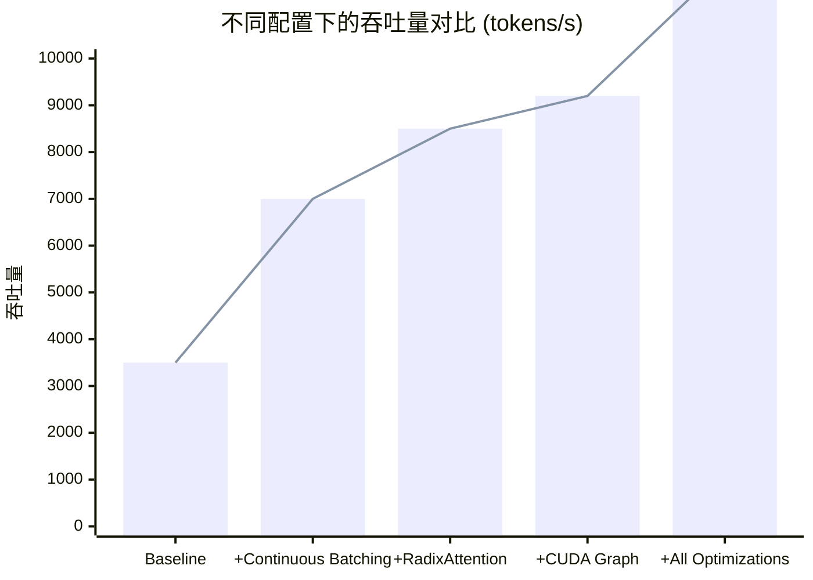

# SGLang 性能优化指南

**创建时间**: 2026-03-02 05:30  
**基于分析**: 7 个核心模块 + 2 个深化模块  
**目标**: 帮助用户最大化 SGLang 性能

---

## 一、性能基准数据

### 1.1 不同优化技术的效果

| 优化技术 | 场景 | 提升幅度 | 实现难度 |
|---------|------|---------|---------|
| Continuous Batching | 高并发 | 2-3x | ⭐ 自动 |
| RadixAttention | 多轮对话 | 1.7-2.3x | ⭐ 自动 |
| CUDA Graph | Decode | 2-5x | ⭐ 自动 |
| LPM 调度 | 多轮对话 | 1.3-1.5x | ⭐ 配置 |
| FP8 量化 | 大模型 | 1.5-2x | ⭐⭐ 配置 |
| FlashInfer | 所有场景 | 1.2-1.8x | ⭐ 配置 |

### 1.2 端到端性能对比



---

## 二、配置优化手册

### 2.1 显存优化配置

#### 场景 1: 显存不足 (OOM)

```bash
# 问题：CUDA out of memory
# 解决方案：

# 1. 减小静态显存比例 (默认 0.9)
python -m sglang.launch_server \
    --mem-fraction-static 0.8

# 2. 减少最大并发请求 (默认 16384)
python -m sglang.launch_server \
    --max-running-requests 512

# 3. 增大 page size (默认 1)
python -m sglang.launch_server \
    --page-size 32

# 4. 启用 KV Cache 量化
python -m sglang.launch_server \
    --kv-cache-dtype fp8

# 5. 启用 CPU offload
python -m sglang.launch_server \
    --enable-memory-saver
```

#### 场景 2: KV Cache 命中率低

```bash
# 问题：RadixAttention 命中率低
# 解决方案：

# 1. 使用 LPM 调度策略
python -m sglang.launch_server \
    --schedule-policy lpm

# 2. 增大显存容量
python -m sglang.launch_server \
    --mem-fraction-static 0.95

# 3. 减小 page size (提高粒度)
python -m sglang.launch_server \
    --page-size 1
```

### 2.2 吞吐量优化配置

#### 场景 3: 提高吞吐量

```bash
# 1. 增大最大并发请求
python -m sglang.launch_server \
    --max-running-requests 2048

# 2. 启用重叠调度 (默认启用)
python -m sglang.launch_server \
    --enable-overlap-schedule

# 3. 使用 FlashInfer 后端
python -m sglang.launch_server \
    --attention-backend flashinfer

# 4. 启用 Chunked Prefill
python -m sglang.launch_server \
    --chunked-prefill-size 4096

# 5. 启用多 DP (数据并行)
python -m sglang.launch_server \
    --dp-size 4
```

#### 场景 4: 降低延迟

```bash
# 1. 启用 CUDA Graph (默认启用)
# 无需配置，自动启用

# 2. 使用 Tensor Cores (FP8)
python -m sglang.launch_server \
    --kv-cache-dtype fp8

# 3. 减小 batch size
python -m sglang.launch_server \
    --max-running-requests 128

# 4. 启用 Low Latency 模式 (MoE)
python -m sglang.launch_server \
    --deepep-mode low_latency

# 5. 禁用重叠调度 (减少 CPU 开销)
python -m sglang.launch_server \
    --disable-overlap-schedule
```

### 2.3 MoE 模型优化配置

#### 场景 5: MoE 模型性能优化

```bash
# 1. 选择 DeepEP 模式
python -m sglang.launch_server \
    --deepep-mode auto  # 自动选择

# 2. 配置 DeepEP
python -m sglang.launch_server \
    --deepep-config '{"normal_dispatch": {"num_sms": 128}, "normal_combine": {"num_sms": 128}}'

# 3. 启用 Expert Parallel
python -m sglang.launch_server \
    --ep-size 4

# 4. 启用 EPLB (Expert Load Balancing)
python -m sglang.launch_server \
    --enable-eplb
```

---

## 三、监控与诊断

### 3.1 关键监控指标

| 指标 | 正常范围 | 告警阈值 | 说明 |
|------|---------|---------|------|
| GPU 利用率 | 70-95% | <50% | 低于 50% 表示未充分利用 |
| KV Cache 使用率 | 60-90% | >95% | 高于 95% 可能 OOM |
| Radix Cache 命中率 | 40-80% | <20% | 低于 20% 检查调度策略 |
| 平均批次大小 | 32-128 | <16 | 低于 16 表示并发不足 |
| 单步耗时 | 10-50ms | >100ms | 高于 100ms 检查瓶颈 |

### 3.2 诊断工具

#### 工具 1: 查看 Radix Cache 状态

```python
import requests

response = requests.get("http://localhost:30000/radix_cache_status")
print(response.json())

# 输出示例:
# {
#   "protected_size": 50000,
#   "evictable_size": 100000,
#   "total_size": 150000,
#   "hit_rate": 0.65
# }
```

#### 工具 2: 查看调度器状态

```python
response = requests.get("http://localhost:30000/scheduler_status")
print(response.json())

# 输出示例:
# {
#   "waiting_queue_size": 50,
#   "running_batch_size": 64,
#   "step_time_ms": 25,
#   "gpu_utilization": 0.85
# }
```

#### 工具 3: 查看性能指标

```python
response = requests.get("http://localhost:30000/metrics")
print(response.text)

# Prometheus 格式输出
```

---

## 四、最佳实践

### 4.1 多轮对话场景

**场景特点**: 大量共享前缀

**推荐配置**:
```bash
python -m sglang.launch_server \
    --model-path meta-llama/Llama-3.1-8B-Instruct \
    --schedule-policy lpm \
    --mem-fraction-static 0.9 \
    --max-running-requests 512 \
    --attention-backend flashinfer
```

**预期效果**:
- Radix Cache 命中率：60-80%
- 吞吐量提升：1.7-2.3x

### 4.2 少样本学习场景

**场景特点**: 长 prompt，大量共享前缀

**推荐配置**:
```bash
python -m sglang.launch_server \
    --model-path meta-llama/Llama-3.1-8B-Instruct \
    --schedule-policy lpm \
    --chunked-prefill-size 8192 \
    --mem-fraction-static 0.85
```

**预期效果**:
- Radix Cache 命中率：50-70%
- 首 token 延迟降低：30-50%

### 4.3 高并发场景

**场景特点**: 大量独立请求

**推荐配置**:
```bash
python -m sglang.launch_server \
    --model-path meta-llama/Llama-3.1-8B-Instruct \
    --schedule-policy fcfs \
    --max-running-requests 2048 \
    --mem-fraction-static 0.8 \
    --page-size 32
```

**预期效果**:
- 吞吐量：8000-12000 tokens/s
- GPU 利用率：85-95%

### 4.4 MoE 模型场景

**场景特点**: 专家路由通信开销大

**推荐配置**:
```bash
python -m sglang.launch_server \
    --model-path deepseek-ai/DeepSeek-MoE-16B \
    --ep-size 4 \
    --deepep-mode auto \
    --attention-backend flashinfer
```

**预期效果**:
- 通信开销降低：40-60%
- 吞吐量提升：1.5-2x

---

## 五、故障排查

### 5.1 常见问题与解决方案

#### 问题 1: CUDA Out of Memory

**症状**:
```
RuntimeError: CUDA out of memory. Tried to allocate ...
```

**排查步骤**:
```bash
# 1. 查看显存使用
nvidia-smi

# 2. 查看 KV Cache 使用率
curl http://localhost:30000/radix_cache_status

# 3. 查看日志
tail -f scheduler.log | grep -i "memory\|oom"
```

**解决方案**:
```bash
# 按优先级尝试:
# 1. 减小 mem-fraction-static
--mem-fraction-static 0.8

# 2. 减少 max-running-requests
--max-running-requests 256

# 3. 增大 page-size
--page-size 64

# 4. 启用 FP8 量化
--kv-cache-dtype fp8
```

#### 问题 2: 请求堆积

**症状**:
- waiting_queue_size 持续增长
- 响应延迟增加

**排查步骤**:
```bash
# 1. 查看队列大小
curl http://localhost:30000/scheduler_status

# 2. 查看批次大小
curl http://localhost:30000/metrics | grep batch_size

# 3. 查看 GPU 利用率
nvidia-smi
```

**解决方案**:
```bash
# 1. 增大 max-running-requests
--max-running-requests 1024

# 2. 检查调度策略
--schedule-policy lpm  # 多轮对话
--schedule-policy fcfs  # 独立请求

# 3. 启用 Chunked Prefill
--chunked-prefill-size 4096
```

#### 问题 3: Radix Cache 命中率低

**症状**:
- 命中率 <20%
- 重复计算多

**排查步骤**:
```bash
# 1. 查看命中率
curl http://localhost:30000/radix_cache_status | jq .hit_rate

# 2. 查看调度策略
curl http://localhost:30000/scheduler_status | jq .schedule_policy

# 3. 查看 protected_size vs evictable_size
curl http://localhost:30000/radix_cache_status | jq '{protected, evictable}'
```

**解决方案**:
```bash
# 1. 使用 LPM 调度
--schedule-policy lpm

# 2. 增大显存容量
--mem-fraction-static 0.95

# 3. 检查请求模式 (是否真的有共享前缀)
```

---

## 六、性能调优实验

### 实验 1: 调度策略对比

**目标**: 对比 FCFS vs LPM

**步骤**:
```bash
# 实验 1: FCFS
python -m sglang.launch_server \
    --model-path meta-llama/Llama-3.1-8B-Instruct \
    --schedule-policy fcfs \
    --port 30001

# 运行基准测试
python benchmark/mtbench.py --port 30001

# 实验 2: LPM
python -m sglang.launch_server \
    --model-path meta-llama/Llama-3.1-8B-Instruct \
    --schedule-policy lpm \
    --port 30002

# 运行基准测试
python benchmark/mtbench.py --port 30002

# 对比结果
```

**预期结果**:
- 多轮对话：LPM 吞吐量提升 30-50%
- 独立请求：FCFS 略优或持平

### 实验 2: Page Size 优化

**目标**: 找到最优 page size

**步骤**:
```bash
# 测试不同 page size
for page_size in 1 8 16 32 64; do
    python -m sglang.launch_server \
        --model-path meta-llama/Llama-3.1-8B-Instruct \
        --page-size $page_size \
        --port 3000$((page_size / 8 + 1))
    
    python benchmark/mtbench.py --port 3000$((page_size / 8 + 1))
done
```

**预期结果**:
- page_size=1: 命中率最高，但管理开销大
- page_size=32: 平衡点
- page_size=64: 吞吐量最高，但命中率略降

---

**持续更新中...** 🚀
