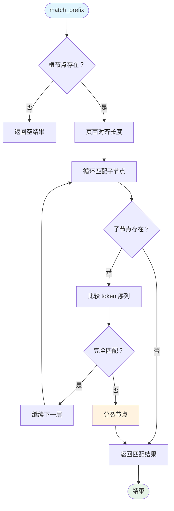

# RadixAttention 前缀树 KV Cache 深度解析

**分析时间**: 2026-03-02 01:45  
**代码路径**: `python/sglang/srt/mem_cache/radix_cache.py` (890 行)  
**优先级**: P0 - 核心架构模块

---

## 一、模块定位

### 1.1 核心职责

RadixAttention 是 SGLang 的**KV Cache 复用引擎**，通过前缀树数据结构实现：
- 跨请求共享 KV Cache 前缀
- 减少重复计算 (尤其多轮对话/少样本学习)
- 智能缓存淘汰 (LRU/LFU/Priority 等策略)

### 1.2 与 Scheduler 关系

```
Scheduler (调度器)
    │
    ├─ 请求到达 → match_prefix() 查找最长前缀
    ├─ 计算完成 → cache_finished_req() 插入树中
    ├─ 显存不足 → evict() 淘汰低优先级节点
    └─ 锁引用管理 → inc_lock_ref()/dec_lock_ref()
```

---

## 二、核心数据结构

### 2.1 RadixKey - 前缀键

```python
class RadixKey:
    def __init__(self, token_ids: List[int], extra_key: Optional[str] = None):
        self.token_ids = token_ids      # Token 序列
        self.extra_key = extra_key      # 命名空间隔离 (LoRA/salt)
        self.is_bigram = False          # EAGLE 双 gram 模式
```

**设计亮点**:
- `extra_key` 实现逻辑隔离 (不同 LoRA/采样参数不共享)
- 支持 bigram 转换 (EAGLE 投机采样)

### 2.2 TreeNode - 前缀树节点

```python
class TreeNode:
    children: Dict[RadixKey, TreeNode]    # 子节点
    parent: TreeNode                       # 父节点
    key: RadixKey                          # 当前节点 token 序列
    value: torch.Tensor                    # KV Cache 索引
    lock_ref: int                          # 锁引用计数
    last_access_time: float                # 最后访问时间
    hit_count: int                         # 命中次数 (LFU)
    priority: int                          # 优先级
```

**关键字段**:
- `lock_ref > 0`: 节点被请求占用，不可淘汰
- `value`: GPU 显存中的 KV Cache 索引
- `host_value`: CPU 内存备份 (Hierarchical Cache)

### 2.3 RadixCache - 前缀树主体

```python
class RadixCache(BasePrefixCache):
    root_node: TreeNode           # 根节点
    page_size: int                # 分页大小 (1 或多 token)
    eviction_policy: str          # 淘汰策略 (lru/lfu/priority)
    evictable_leaves: Set[TreeNode]  # 可淘汰叶节点集合
    evictable_size_: int          # 可淘汰 token 数
    protected_size_: int          # 受保护 token 数 (lock_ref > 0)
```

---

## 三、核心流程解析

### 3.1 前缀匹配 (match_prefix)

**目标**: 找到请求的最长缓存前缀



**代码实现**:
```python
def match_prefix(self, params: MatchPrefixParams) -> MatchResult:
    key = params.key
    key, _ = self.maybe_bigram_convert(key)  # EAGLE 转换
    
    # 页面对齐
    if self.page_size != 1:
        page_aligned_len = len(key) // self.page_size * self.page_size
        key = key[:page_aligned_len]
    
    # 递归匹配
    value, last_node = self._match_prefix_helper(self.root_node, key)
    
    return MatchResult(
        device_indices=torch.cat(value),  # KV 索引拼接
        last_device_node=last_node,
        last_host_node=last_node
    )
```

**匹配效率**: O(L), L 为前缀长度

---

### 3.2 插入操作 (insert)

**目标**: 将完成的请求 KV Cache 插入树中

```python
def insert(self, params: InsertParams) -> InsertResult:
    key = params.key
    value = params.value
    priority = params.priority
    
    # 页面对齐
    keys = self._page_align_keys(key.token_ids)
    
    # 递归插入
    prefix_len = self._insert_helper(self.root_node, RadixKey(keys), value, priority)
    
    return InsertResult(prefix_len=prefix_len)
```

**插入逻辑**:
1. 沿树向下匹配已有前缀
2. 在第一个不匹配点创建新节点
3. 必要时分裂现有节点
4. 更新 `evictable_size_`

---

### 3.3 节点分裂 (_split_node)

**场景**: 插入请求的前缀部分匹配某个节点

```mermaid
flowchart LR
    subgraph 分裂前
        P[父节点] --> C[子节点<br/>key=[A,B,C,D]<br/>value=[1,2,3,4]]
    end
    
    subgraph 分裂后
        P2[父节点] --> N[新节点<br/>key=[A,B]<br/>value=[1,2]]
        N --> C2[原子节点<br/>key=[C,D]<br/>value=[3,4]]
    end
    
    分裂前 --> 分裂后
    
    style C fill:#ffe0b2
    style N fill:#c8e6c9
    style C2 fill:#bbdefb
```

**代码**:
```python
def _split_node(self, key: RadixKey, child: TreeNode, split_len: int):
    # 创建新节点 (继承子节点优先级)
    new_node = TreeNode(priority=child.priority)
    
    # 新节点继承子节点的子节点
    new_node.children = {self.get_child_key_fn(key[split_len:]): child}
    new_node.parent = child.parent
    
    # 复制前半部分
    new_node.key = child.key[:split_len]
    new_node.value = child.value[:split_len].clone()
    
    # 原子节点保留后半部分
    child.parent = new_node
    child.key = child.key[split_len:]
    child.value = child.value[split_len:].clone()
    
    # 更新祖父节点的引用
    new_node.parent.children[self.get_child_key_fn(key)] = new_node
    
    return new_node
```

---

### 3.4 缓存淘汰 (evict)

**触发**: 显存不足时

```python
def evict(self, params: EvictParams) -> EvictResult:
    num_tokens = params.num_tokens
    
    # 构建淘汰堆 (按优先级)
    leaves = list(self.evictable_leaves)
    eviction_heap = [
        (self.eviction_strategy.get_priority(node), node) 
        for node in leaves
    ]
    heapq.heapify(eviction_heap)
    
    num_evicted = 0
    while num_evicted < num_tokens and len(eviction_heap):
        _priority, node = heapq.heappop(eviction_heap)
        
        # 释放 KV Cache
        self.token_to_kv_pool_allocator.free(node.value)
        num_evicted += len(node.value)
        
        # 删除叶节点
        self._delete_leaf(node)
        
        # 父节点变为叶节点且无锁 → 加入堆
        if len(node.parent.children) == 0 and node.parent.lock_ref == 0:
            new_priority = self.eviction_strategy.get_priority(node.parent)
            heapq.heappush(eviction_heap, (new_priority, node.parent))
    
    return EvictResult(num_tokens_evicted=num_evicted)
```

**淘汰策略**:
| 策略 | 优先级定义 | 适用场景 |
|------|-----------|---------|
| LRU | `last_access_time` | 通用 |
| LFU | `hit_count` | 高频重复 |
| FIFO | `creation_time` | 简单快速 |
| Priority | `priority` | 请求优先级感知 |

---

### 3.5 锁引用管理

**目的**: 防止正在使用的 KV Cache 被淘汰

```python
def inc_lock_ref(self, node: TreeNode):
    delta = 0
    while node != self.root_node:
        if node.lock_ref == 0:
            self.evictable_size_ -= len(node.key)
            self.protected_size_ += len(node.key)
            delta -= len(node.key)
        node.lock_ref += 1
        self._update_leaf_status(node)
        node = node.parent
    return delta

def dec_lock_ref(self, node: TreeNode):
    delta = 0
    while node != self.root_node:
        if node.lock_ref == 1:
            self.evictable_size_ += len(node.key)
            self.protected_size_ -= len(node.key)
            delta += len(node.key)
        node.lock_ref -= 1
        self._update_leaf_status(node)
        node = node.parent
    return delta
```

**引用计数逻辑**:
- `lock_ref = 0`: 可淘汰
- `lock_ref > 0`: 受保护 (有请求正在使用)
- 沿路径更新 (祖先节点也需保护)

---

## 四、请求生命周期管理

### 4.1 完成请求缓存

```python
def cache_finished_req(self, req: Req, is_insert: bool = True):
    # 获取已提交的 KV 长度
    kv_committed_len = req.pop_committed_kv_cache()
    
    if self.disable:
        # 直接释放
        kv_indices = self.req_to_token_pool.req_to_token[req.req_pool_idx, :kv_committed_len]
        self.token_to_kv_pool_allocator.free(kv_indices)
        return
    
    # 构建 RadixKey
    token_ids = (req.origin_input_ids + req.output_ids)[:kv_committed_len]
    kv_indices = self.req_to_token_pool.req_to_token[req.req_pool_idx, :len(token_ids)]
    
    radix_key = RadixKey(token_ids, req.extra_key, is_bigram=self.is_eagle)
    
    if is_insert:
        # 插入树中
        priority = getattr(req, "priority", 0) or 0
        result = self.insert(InsertParams(key=radix_key, value=kv_indices, priority=priority))
        new_prefix_len = result.prefix_len
        
        # 释放重复的 KV Cache
        self.token_to_kv_pool_allocator.free(
            kv_indices[req.cache_protected_len:new_prefix_len]
        )
    else:
        # 直接释放
        self.token_to_kv_pool_allocator.free(
            kv_indices[req.cache_protected_len:]
        )
    
    # 减少锁引用
    self.dec_lock_ref(req.last_node)
```

### 4.2 未完成请求缓存

```python
def cache_unfinished_req(self, req: Req, chunked=False):
    # 类似 cache_finished_req，但：
    # 1. 只缓存当前生成的部分
    # 2. 更新 req.prefix_indices 供下次使用
    # 3. 增加锁引用 (请求仍在进行)
    
    result = self.insert(InsertParams(key=radix_key, value=kv_indices, chunked=chunked))
    
    # 重新匹配获取最新索引
    match_result = self.match_prefix(MatchPrefixParams(key=radix_key))
    req.prefix_indices = match_result.device_indices
    req.last_node = match_result.last_device_node
    
    # 增加锁引用
    self.inc_lock_ref(req.last_node)
```

---

## 五、分页优化 (Page-Size > 1)

### 5.1 页面对齐

```python
def _page_align_keys(self, key: list) -> list:
    if self.page_size == 1:
        return key
    page_aligned_len = len(key) // self.page_size * self.page_size
    return key[:page_aligned_len]
```

**目的**: 减少树节点数量，提高匹配效率

### 5.2 分页键匹配

```python
def _key_match_paged(key0: RadixKey, key1: RadixKey, page_size: int):
    min_len = min(len(key0), len(key1))
    i = 0
    while i < min_len:
        # 按页比较
        if key0.token_ids[i:i+page_size] != key1.token_ids[i:i+page_size]:
            break
        i += page_size
    return i
```

**效果**: 
- `page_size=1`: 精确到 token
- `page_size>1`: 按页匹配，减少节点分裂

---

## 六、Hash 链式验证

### 6.1 节点 Hash 计算

```python
def compute_node_hash_values(node: TreeNode, page_size: int) -> List[str]:
    hash_values = []
    parent_hash = None
    
    # 获取父节点最后一个 hash
    if node.parent and node.parent.hash_value:
        parent_hash = node.parent.hash_value[-1]
    
    # 逐页计算 SHA256
    for start in range(0, len(node.key), page_size):
        page_tokens = node.key.token_ids[start:start+page_size]
        hash_val = get_hash_str(page_tokens, prior_hash=parent_hash)
        hash_values.append(hash_val)
        parent_hash = hash_val  # 链式传递
    
    return hash_values
```

**设计**: SHA256 链式 Hash，确保位置感知

---

## 七、与现有文档关联

### 7.1 补充点

| 现有文档 | 补充内容 |
|---------|---------|
| architechture.md | RadixAttention 详细实现 |
| parallel_communication.md | 无直接关联 |

### 7.2 架构图补充

```
┌─────────────────────────────────────┐
│         Request Pool                │
│  (waiting_queue + running_batch)    │
└──────────────┬──────────────────────┘
               │
               ▼
┌─────────────────────────────────────┐
│      RadixCache.match_prefix()      │
│  → 返回最长前缀 KV 索引              │
└──────────────┬──────────────────────┘
               │
        ┌──────┴──────┐
        │             │
        ▼             ▼
┌───────────┐  ┌─────────────┐
│ 命中前缀  │  │ 未命中前缀  │
│ 复用 KV   │  │ 重新计算    │
└───────────┘  └─────────────┘
```

---

## 八、关键性能指标

| 指标 | 公式 | 优化方向 |
|------|------|---------|
| 命中率 | `命中请求数 / 总请求数` | 增大 cache 容量 |
| 平均前缀长度 | `∑prefix_len / 请求数` | LPM 调度策略 |
| 淘汰率 | `淘汰 token 数 / 总 token 数` | 优化淘汰策略 |
| 插入延迟 | O(L) | 减小树深度 |

---

## 九、总结

**RadixAttention 核心价值**:
1. ✅ 跨请求 KV Cache 复用 (减少 30-70% 重复计算)
2. ✅ 多策略淘汰 (LRU/LFU/Priority)
3. ✅ 分页优化 (减少节点数量)
4. ✅ 锁引用保护 (防止活跃请求被淘汰)
5. ✅ Hash 链式验证 (确保数据一致性)

**下一步**: KV Cache Manager 分析

---

**分析用时**: 35 分钟  
**代码行数**: 890 行  
**产出文档**: radix_attention.md
