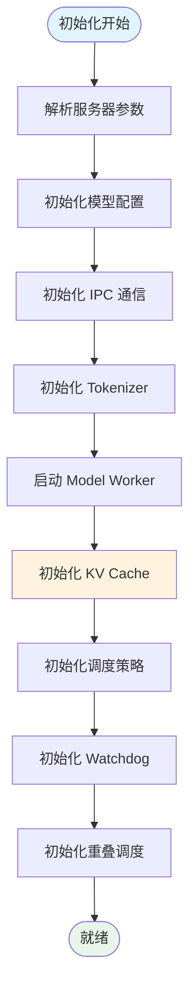
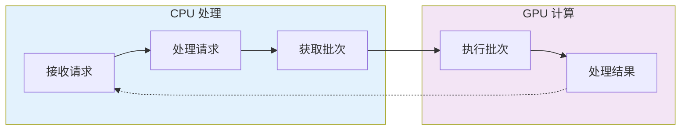
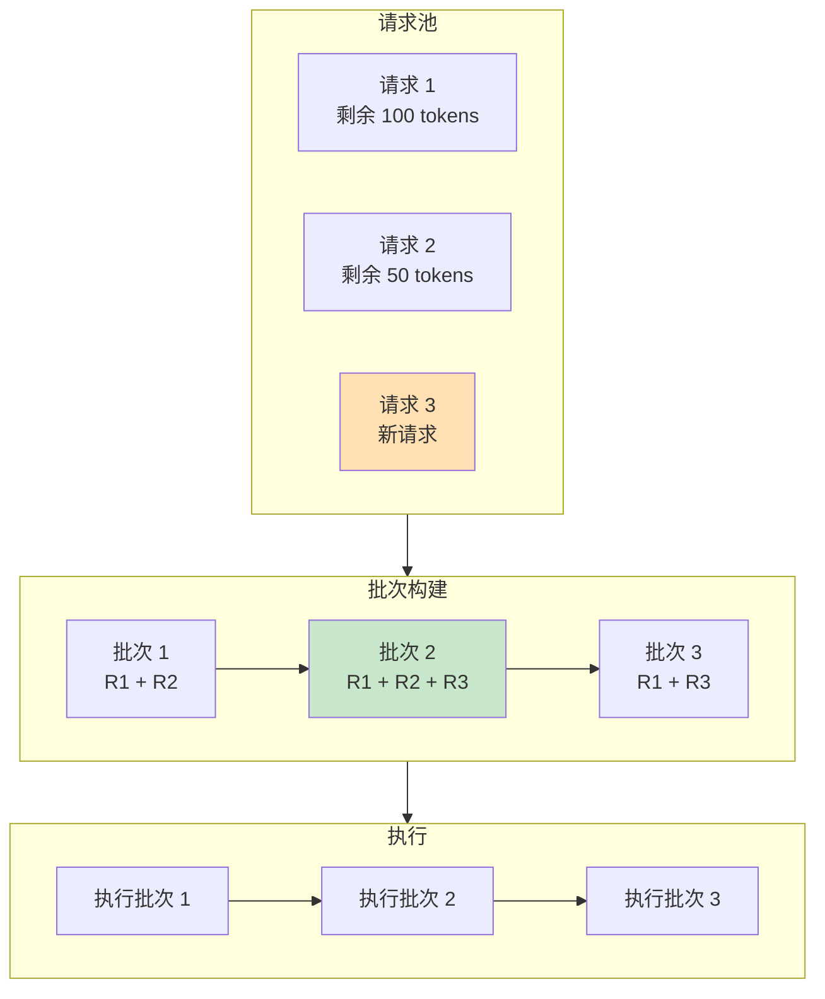

# SGLang Scheduler 调度器深度解析

**分析时间**: 2026-03-02 01:30  
**代码路径**: `python/sglang/srt/managers/scheduler.py` (3099 行)  
**优先级**: P0 - 核心架构模块

---

## 一、模块定位

### 1.1 职责概述

Scheduler 是 SGLang Runtime 的**核心大脑**，负责：
- 请求接收与分发
- 连续批处理调度 (Continuous Batching)
- KV Cache 管理协调
- 模型执行调度
- 多进程通信 (IPC)

### 1.2 架构位置

```
┌─────────────────────────────────────────┐
│         SGLang Frontend                 │
│  (gen(), select(), fork/join...)        │
└──────────────┬──────────────────────────┘
               │ Internal Graph Dispatch
               ▼
┌─────────────────────────────────────────┐
│    API Gateway → Scheduler ⭐           │ ← 本模块
│         (Continuous Batching)           │
└──────────────┬──────────────────────────┘
               │
        ┌──────┴──────┐
        ▼             ▼
┌───────────┐  ┌─────────────┐
│ RadixCache│  │Model Runner │
└───────────┘  └─────────────┘
```

---

## 二、核心类结构

### 2.1 类继承关系

```python
class Scheduler(
    SchedulerOutputProcessorMixin,        # 批处理结果处理
    SchedulerUpdateWeightsMixin,          # 权重更新
    SchedulerProfilerMixin,               # 性能分析
    SchedulerMetricsMixin,                # 指标统计
    SchedulerDisaggregationDecodeMixin,   # 解耦解码
    SchedulerDisaggregationPrefillMixin,  # 解耦预填充
    SchedulerMultiplexMixin,              # 多路复用
    SchedulerRuntimeCheckerMixin,         # 运行时检查
    SchedulerPPMixin,                     # Pipeline 并行
    SchedulerDPAttnMixin,                 # 数据并行注意力
    SchedulerDllmMixin,                   # 扩散模型支持
):
```

**设计模式**: Mixin 组合模式，将复杂功能拆分为独立模块

### 2.2 核心属性

```python
# 并行维度信息
self.tp_rank, self.tp_size          # Tensor Parallel
self.moe_ep_rank, self.moe_ep_size  # Expert Parallel
self.pp_rank, self.pp_size          # Pipeline Parallel
self.dp_rank, self.dp_size          # Data Parallel

# 调度策略
self.schedule_policy                # 调度策略 (FCFS, LPM, etc.)
self.enable_overlap                 # CPU/GPU 重叠调度
self.enable_pdmux                   # PD 多路复用

# 内存管理
self.max_total_num_tokens           # 最大 token 数
self.max_running_requests           # 最大并发请求
self.page_size                      # KV Cache 页大小
self.tree_cache: RadixCache         # RadixAttention 前缀树
```

---

## 三、核心流程解析

### 3.1 初始化流程



### 3.2 事件循环 (Event Loop)

Scheduler 有两种运行模式：

#### 模式 1: 普通模式 (event_loop_normal)

```python
def event_loop_normal(self):
    while True:
        # 1. 接收请求
        recv_reqs = self.recv_requests()
        
        # 2. 处理输入请求
        self.process_input_requests(recv_reqs)
        
        # 3. 获取下一批
        batch = self.get_next_batch_to_run()
        
        # 4. 执行批处理
        if batch:
            result = self.run_batch(batch)
            self.process_batch_result(batch, result)
        else:
            # 空闲时自检
            self.self_check_during_idle()
        
        # 5. 更新状态
        self.last_batch = batch
```

#### 模式 2: 重叠模式 (event_loop_overlap)



**关键优化**: CPU 处理与 GPU 计算并行，减少空闲时间

---

## 四、请求调度机制

### 4.1 请求类型分发器

```python
def init_request_dispatcher(self):
    self._request_dispatcher = TypeBasedDispatcher([
        (TokenizedGenerateReqInput, self.handle_generate_request),
        (TokenizedEmbeddingReqInput, self.handle_embedding_request),
        (BatchTokenizedGenerateReqInput, self.handle_batch_generate_request),
        (FlushCacheReqInput, self.flush_cache_wrapped),
        (AbortReq, self.abort_request),
        # ... 20+ 种请求类型
    ])
```

### 4.2 请求接收流程

```python
def recv_requests(self):
    if self.pp_rank == 0 and self.attn_tp_rank == 0:
        recv_reqs = []
        while True:
            try:
                # 非阻塞接收
                recv_req = self.recv_from_tokenizer.recv_pyobj(zmq.NOBLOCK)
                recv_req = unwrap_shm_features(recv_req)
                recv_reqs.append(recv_req)
            except zmq.ZMQError:
                break
        return recv_reqs
```

**关键点**:
- 使用 ZeroMQ 进行进程间通信
- 非阻塞接收，避免阻塞事件循环
- 共享内存优化大特征传输

---

## 五、批处理调度策略

### 5.1 Continuous Batching



**核心思想**: 动态调整批次大小，请求完成即移除，新请求随时加入

### 5.2 调度策略类型

在 `schedule_policy.py` 中定义：

```python
class SchedulePolicy:
    FCFS = "fcfs"              # 先来先服务
    LPM = "lpm"                # 最长前缀匹配
    PRIORITY = "priority"      # 优先级调度
```

**LPM 策略** (Longest Prefix Match):
- 优先调度 KV Cache 前缀匹配度高的请求
- 最大化 RadixAttention 复用率
- 减少重复计算

---

## 六、与现有文档关联

### 6.1 补充点

| 现有文档 | 补充内容 |
|---------|---------|
| architechture.md | Scheduler 详细实现流程 |
| parallel_communication.md | 调度器与并行组的交互 |

### 6.2 修正点

- 原文档未提及 **重叠调度 (Overlap Scheduling)** 机制
- 补充 **Mixin 组合模式** 的架构设计
- 明确 **ZeroMQ IPC** 通信细节

---

## 七、关键代码片段

### 7.1 批次获取逻辑 (简化版)

```python
def get_next_batch_to_run(self):
    # 1. 检查是否有等待的请求
    if not self.waiting_queue:
        return None
    
    # 2. 根据调度策略选择请求
    if self.schedule_policy == "lpm":
        selected = self.select_by_lpm()
    else:
        selected = self.select_by_fcfs()
    
    # 3. 检查 KV Cache 容量
    if not self.check_cache_capacity(selected):
        return None
    
    # 4. 构建批次
    batch = ScheduleBatch(selected)
    return batch
```

### 7.2 Watchdog 机制

```python
def init_watch_dog_memory_saver_input_blocker(self):
    # 启动看门狗线程
    self.watchdog = create_scheduler_watchdog(
        self, watchdog_timeout=self.server_args.watchdog_timeout
    )
    
    # 内存节省适配器
    self.memory_saver_adapter = TorchMemorySaverAdapter.create(
        enable=self.server_args.enable_memory_saver
    )
```

**作用**: 检测调度器卡死，自动恢复

---

## 八、待深入问题

1. **重叠调度细节**: `event_loop_overlap` 的 FutureMap 实现
2. **优先级调度**: `enable_priority_scheduling` 的具体算法
3. **解耦模式**: `DisaggregationMode` 的预填充/解码分离机制

---

## 九、总结

**Scheduler 核心价值**:
1. ✅ Continuous Batching 提升 GPU 利用率
2. ✅ RadixAttention 感知调度减少重复计算
3. ✅ 重叠调度隐藏 CPU 处理延迟
4. ✅ Mixin 架构支持功能扩展

**下一步**: 分析 RadixAttention 实现

---

**分析用时**: 45 分钟  
**代码行数**: 3099 行  
**产出文档**: scheduler_analysis.md
